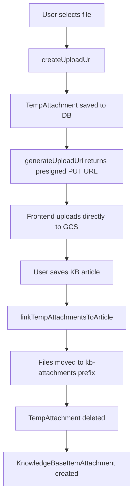

<!-- source-hash: 2436f8dbfe9355840d4a7b609566f4d5 -->
Manages temporary file uploads for Knowledge Base articles before they are permanently saved, mirroring the ticket `TempAttachmentService` pattern with a two-phase upload flow via Google Cloud Storage presigned URLs.

## Key Components

| Method | Description |
|---|---|
| `createUploadUrl()` | Creates a `TempAttachment` record and returns it with a generated storage path under `temp/{uuid}/{fileName}` |
| `generateUploadUrl()` | Produces a GCS presigned PUT URL valid for the configured expiration window (default: 15 minutes) |
| `deleteTempAttachment()` | Removes a temp attachment from GCS and the database, enforcing uploader ownership |
| `linkTempAttachmentsToArticle()` | Moves temp files to permanent `kb-attachments/{articleId}/{fileName}` paths and creates `KnowledgeBaseItemAttachment` records |
| `moveToArticle()` *(private)* | Handles the GCS file move, temp record deletion, and `KnowledgeBaseItemAttachment` construction for a single file |

## Upload Flow


```mermaid
graph TD
    A[User selects file] --> B[createUploadUrl]
    B --> C[TempAttachment saved to DB]
    C --> D[generateUploadUrl returns presigned PUT URL]
    D --> E[Frontend uploads directly to GCS]
    E --> F[User saves KB article]
    F --> G[linkTempAttachmentsToArticle]
    G --> H[Files moved to kb-attachments prefix]
    H --> I[TempAttachment deleted]
    I --> J[KnowledgeBaseItemAttachment created]
```

## Usage Example

```java
// Step 1: Request an upload URL
TempAttachment temp = knowledgeBaseTempAttachmentService
    .createUploadUrl(userId, "diagram.png", "image/png", 204800L);

String presignedUrl = knowledgeBaseTempAttachmentService
    .generateUploadUrl(temp);
// Frontend uses presignedUrl to PUT the file directly to GCS

// Step 2: After article is saved, link accumulated temp attachments
List<KnowledgeBaseItemAttachment> attachments = knowledgeBaseTempAttachmentService
    .linkTempAttachmentsToArticle(articleId, List.of(temp.getId()), userId);
```

## Configuration

| Property | Default | Description |
|---|---|---|
| `openframe.kb.presigned-url-expiration-minutes` | `15` | Presigned URL TTL in minutes |