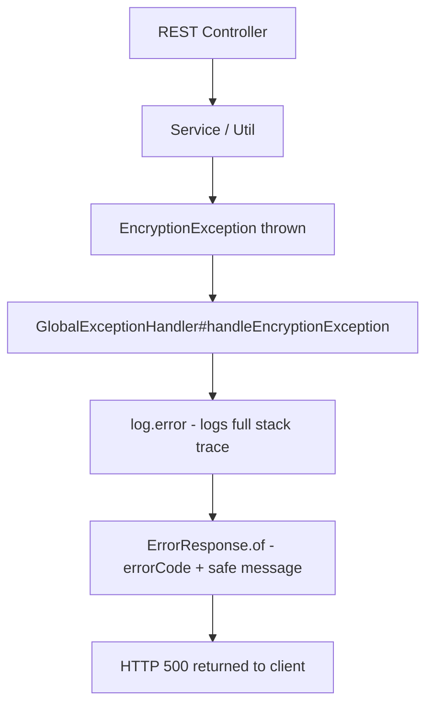

<!-- source-hash: fe0a05a114569a65c8e4b8c17d03bcfe -->
Spring `@RestControllerAdvice` that intercepts application-wide exceptions and maps them to structured `ErrorResponse` objects with appropriate HTTP status codes.

## Key Components

| Component | Description |
|-----------|-------------|
| `@RestControllerAdvice` | Registers this class as a global exception interceptor across all REST controllers |
| `handleEncryptionException` | Catches `EncryptionException`, logs the error, and returns a `500 INTERNAL_SERVER_ERROR` response |
| `ErrorResponse.of(...)` | Constructs a standardized error payload using the exception's error code and a safe user-facing message |

## Usage Example

```java
// Thrown anywhere in the application (e.g., a service layer)
throw new EncryptionException(ErrorCode.DECRYPTION_FAILED, "Failed to decrypt credential");

// GlobalExceptionHandler intercepts it and returns:
// HTTP 500
// {
//   "code": "DECRYPTION_FAILED",
//   "message": "Configuration security error"
// }
```

## Error Handling Flow



> **Note:** The handler deliberately returns a generic `"Configuration security error"` message to the client rather than exposing internal exception details, while the full stack trace is captured via `log.error` for internal diagnostics.