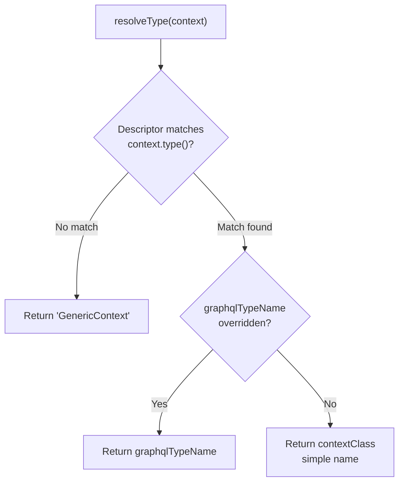

<!-- source-hash: 5bac6395c63f8f4c387b8762c9933277 -->
Unit test suite for `NotificationContextGraphQlTypeResolver`, verifying GraphQL type resolution behavior for `NotificationContext` objects based on registered `NotificationContextDescriptor` entries.

## Key Components

| Component | Role |
|---|---|
| `NotificationContextGraphQlTypeResolver` | Subject under test — resolves a `NotificationContext` to its GraphQL type name |
| `NotificationContextDescriptor` | Interface providing `type()`, `contextClass()`, and optional `graphqlTypeName()` |
| `GenericContext` | Concrete `NotificationContext` used as test fixture |
| `descriptor()` helper | Factory method building anonymous `NotificationContextDescriptor` implementations inline |

## Covered Scenarios

| Test | Expected Outcome |
|---|---|
| No descriptors registered | Falls back to `"GenericContext"` |
| Unknown type (no descriptor match) | Falls back to `"GenericContext"` |
| Matching descriptor with explicit `graphqlTypeName` | Returns the configured type name |
| Matching descriptor without `graphqlTypeName` override | Falls back to `contextClass` simple name |
| Duplicate type discriminators | First registered descriptor wins (deterministic dedup) |

## Usage Example

```java
// Constructing the resolver with descriptors (mirrors test setup)
NotificationContextDescriptor approvalDescriptor = new NotificationContextDescriptor() {
    @Override public String type() { return "approval-request"; }
    @Override public Class<? extends NotificationContext> contextClass() { return ApprovalContext.class; }
    @Override public String graphqlTypeName() { return "ApprovalRequest"; }
};

NotificationContextGraphQlTypeResolver resolver =
    new NotificationContextGraphQlTypeResolver(List.of(approvalDescriptor));

NotificationContext ctx = GenericContext.builder().type("approval-request").build();
String graphqlType = resolver.resolveType(ctx); // → "ApprovalRequest"
```

## Resolution Logic Summary

