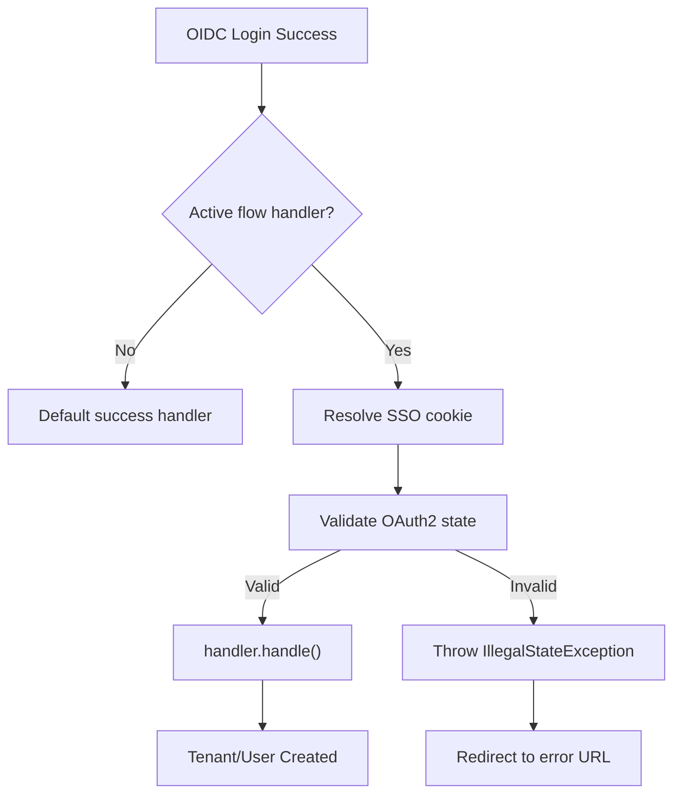

<!-- source-hash: 750db8b2aff83068ade2c8da0a035615 -->
Handles post-OIDC authentication success by routing to the appropriate SSO flow handler for tenant registration or user invitation finalization.

## Key Components

| Element | Description |
|---|---|
| `SsoTenantRegistrationSuccessHandler` | Spring Security success handler extending `SavedRequestAwareAuthenticationSuccessHandler` |
| `flowHandlers` | Injected list of `SsoFlowHandler` implementations; first matching handler is selected |
| `ssoCookieCodec` | Decodes SSO cookies to extract expected OAuth2 state values |
| `onAuthenticationSuccess()` | Entry point; dispatches to the active flow handler or falls back to default behavior |
| `validateStateOrThrow()` | Validates the OAuth2 `state` parameter against the cookie payload to prevent CSRF |

## Flow



## Usage Example

```java
// SsoFlowHandler implementations are auto-discovered from the Spring context.
// Register a custom flow by implementing SsoFlowHandler:
@Component
public class MyCustomSsoFlowHandler implements SsoFlowHandler {

    @Override
    public boolean isActivated(HttpServletRequest request) {
        // Return true when your specific SSO cookie is present
        return CookieUtils.getCookie(request, "my_sso_cookie").isPresent();
    }

    @Override
    public Cookie resolveCookie(HttpServletRequest request) {
        return CookieUtils.getCookie(request, "my_sso_cookie")
                .orElseThrow(() -> new IllegalStateException("Cookie missing"));
    }

    @Override
    public void handle(HttpServletRequest request,
                       HttpServletResponse response,
                       Authentication authentication) throws IOException {
        // Finalize registration using authentication.getPrincipal()
    }
}
```

> **State validation** — both `COOKIE_SSO_REG` and `COOKIE_SSO_INVITE` cookies are decoded and their embedded `state` value is compared against the OAuth2 callback `state` parameter. A mismatch redirects to `openframe.auth.error-url` with a URL-encoded error message.