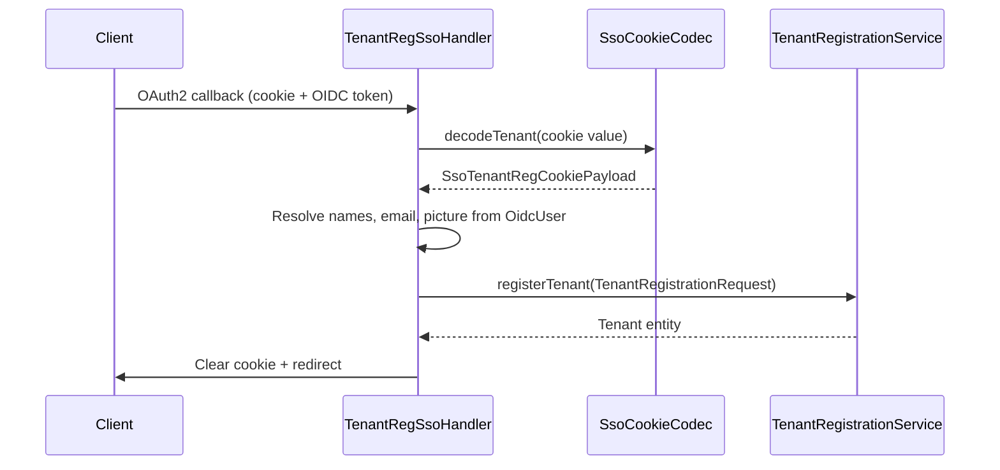

<!-- source-hash: 06d41168862584c6ff867c19687a43aa -->
Handles the SSO-based tenant registration flow by reading an SSO session cookie, extracting OIDC user claims, and completing new tenant provisioning.

## Key Components

| Element | Description |
|---|---|
| `TenantRegSsoHandler` | Spring `@Component` implementing `SsoFlowHandler` for tenant registration via SSO |
| `cookieName()` | Returns the SSO registration cookie name constant (`SsoRegistrationConstants.COOKIE_SSO_REG`) |
| `handle(...)` | Core flow method: validates cookie/user, builds a `TenantRegistrationRequest`, registers the tenant, then clears the cookie and redirects |
| `SsoCookieCodec` | Decodes the encrypted/signed SSO cookie into a `SsoTenantRegCookiePayload` |
| `TenantRegistrationService` | Executes the actual tenant provisioning logic |

## Flow Summary



## Usage Example

```java
// Invoked automatically by the SSO security filter chain.
// The handler is resolved via SsoFlowHandler#cookieName() matching.

// Cookie payload must contain tenantName, tenantDomain, and optional redirectTo:
SsoTenantRegCookiePayload payload = new SsoTenantRegCookiePayload(
    "Acme Corp",          // tenantName
    "acme",               // tenantDomain
    "ACCESS123",          // accessCode
    "/dashboard"          // redirectTo
);
```

> **Note:** A random UUID is assigned as the initial password since authentication is SSO-managed. The tenant domain is normalized to lowercase before registration.