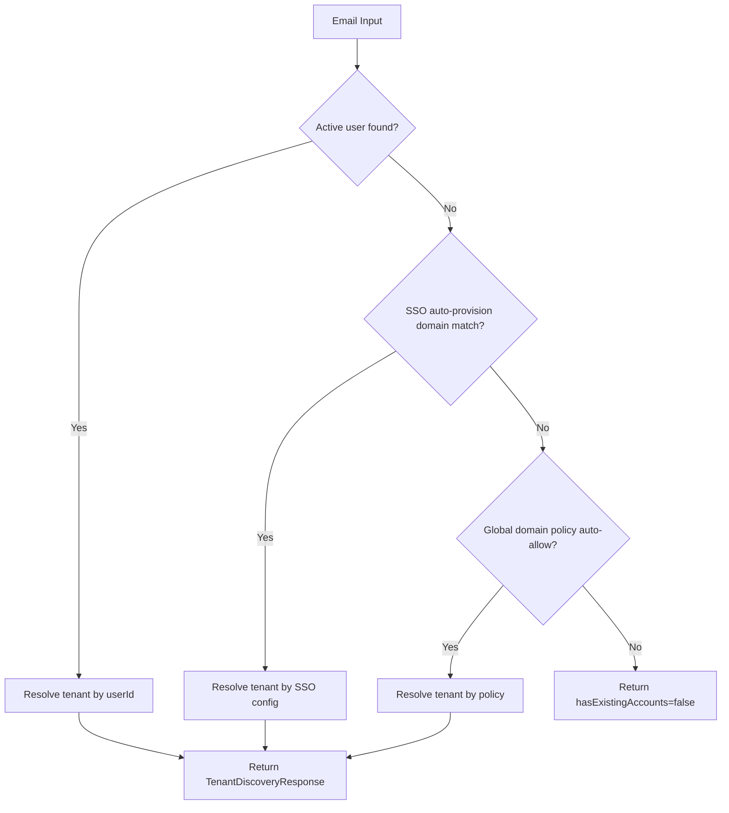

<!-- source-hash: e7f0591d00155c15943526298caba5df -->
Resolves which tenants and authentication providers are available for a given user email, supporting three discovery strategies: existing user lookup, SSO auto-provisioning by domain, and global domain policy matching.

## Key Components

| Member | Type | Description |
|---|---|---|
| `discoverTenantForEmail(String email)` | `public` | Main entry point; returns a `TenantDiscoveryResponse` with tenant info and auth providers |
| `getAvailableAuthProviders(Tenant tenant)` | `private` | Builds the deduplicated list of SSO providers plus the default `openframe-sso` fallback |
| `localTenant` | `@Value` | When `true`, always resolves to the first available tenant (single-tenant mode) |
| `baseDomain` | `@Value` | Configured base domain, defaults to `openframe.ai` |
| `DEFAULT_PROVIDER` | `static final` | Always-included fallback provider: `"openframe-sso"` |

## Discovery Fallback Chain



## Usage Example

```java
@RestController
@RequestMapping("/auth")
@RequiredArgsConstructor
public class AuthController {

    private final TenantDiscoveryService tenantDiscoveryService;

    @GetMapping("/discover")
    public TenantDiscoveryResponse discover(@RequestParam String email) {
        // Returns tenant ID, domain, and available auth providers
        // e.g. ["google-workspace", "openframe-sso"]
        return tenantDiscoveryService.discoverTenantForEmail(email);
    }
}
```

A response with `hasExistingAccounts: false` indicates no tenant could be resolved for the email — the caller should redirect to registration or show an "account not found" message.