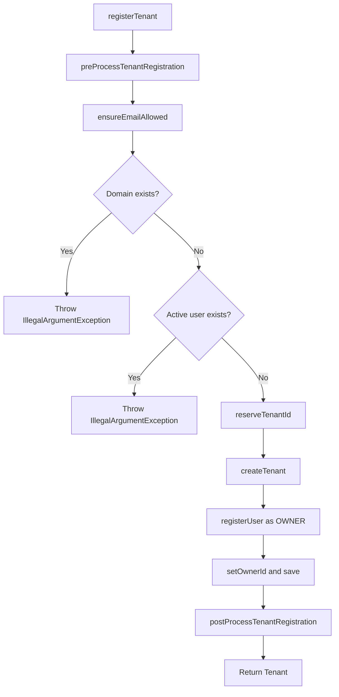

<!-- source-hash: 18747b60e2e305c6d7fbbb8d4e2d46df -->
Orchestrates the end-to-end tenant registration flow, coordinating domain validation, user creation, and pre/post-processing hooks to provision a new tenant with an assigned owner.

## Key Components

| Member | Type | Description |
|---|---|---|
| `registerTenant` | Method | Main registration entry point; validates domain/email, creates tenant and owner user, returns saved `Tenant` |
| `UserService` | Dependency | Checks for existing active users and registers the new owner |
| `TenantService` | Dependency | Handles domain uniqueness checks, tenant creation, and persistence |
| `RegistrationProcessor` | Dependency | Provides pre/post processing hooks and reserves a tenant ID |
| `EmailDomainPolicy` | Dependency | Enforces allowlist/blocklist rules on the registrant's email domain |

## Registration Flow



## Usage Example

```java
TenantRegistrationRequest request = TenantRegistrationRequest.builder()
    .tenantDomain("acme.com")
    .tenantName("Acme Corp")
    .email("admin@acme.com")
    .firstName("Jane")
    .lastName("Doe")
    .password("s3cur3P@ss!")
    .build();

Tenant tenant = tenantRegistrationService.registerTenant(request);
// tenant.getId()      → reserved+persisted tenant ID
// tenant.getOwnerId() → ID of the newly created OWNER user
```

## Validation Guards

- **Domain uniqueness** — throws `IllegalArgumentException` if `tenantDomain` is already registered.
- **Active user conflict** — throws `IllegalArgumentException` if the email already belongs to an active user in another tenant.
- **Email domain policy** — delegates to `EmailDomainPolicy.ensureEmailAllowed` before any persistence occurs.