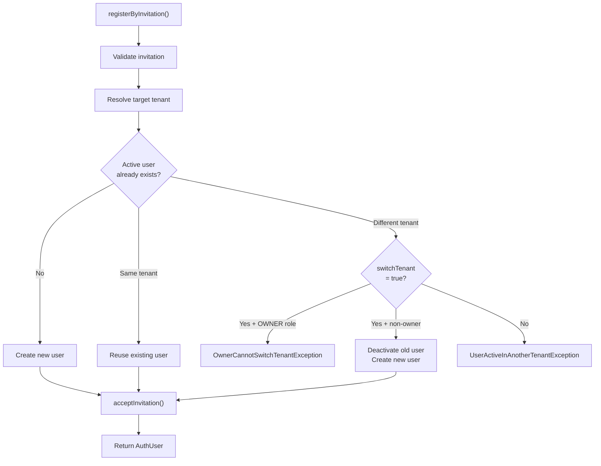

<!-- source-hash: 0dd500b74c53072d63e3581f2726c340 -->
Handles the full registration flow for invited users, including tenant resolution, existing-user conflict detection, and post-registration processing.

## Key Components

| Member | Type | Description |
|--------|------|-------------|
| `registerByInvitation` | Public Method | Entry point — validates invitation, resolves tenant, creates or reuses user, then accepts the invitation |
| `resolveTargetTenantId` | Private Method | Returns the local tenant ID (single-tenant mode) or the invitation's tenant ID |
| `handleExistingActiveUser` | Private Method | Resolves conflicts when an active user already exists: reuse, deactivate-and-switch, or throw |
| `createUserForInvitation` | Private Method | Delegates new-user creation to `UserService` using invitation metadata |
| `acceptInvitation` | Private Method | Marks the invitation `ACCEPTED`, persists it, and triggers post-processing hooks |
| `markVerifiedQuietly` | Private Method | Marks the user's email as verified without blocking the flow on failure |

## Usage Example

```java
// Inject the service
@Autowired
private InvitationRegistrationService invitationRegistrationService;

// Build the request from a frontend payload
InvitationRegistrationRequest request = InvitationRegistrationRequest.builder()
    .invitationId("inv-abc123")
    .firstName("Jane")
    .lastName("Doe")
    .password("SecureP@ss1")
    .switchTenant(false)       // set true to allow cross-tenant migration
    .build();

// Register — throws if invitation is invalid, expired, or tenant conflict exists
AuthUser newUser = invitationRegistrationService.registerByInvitation(request);
```

## Tenant-Switch Behaviour

