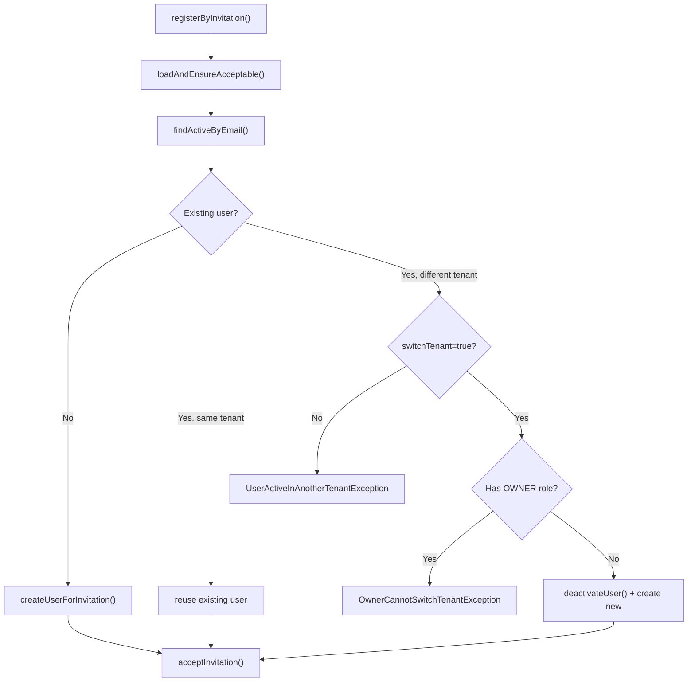

<!-- source-hash: 0dd500b74c53072d63e3581f2726c340 -->
Handles the full registration flow for invitation-based user sign-ups, resolving tenant assignment, managing existing active users, and finalizing invitation acceptance.

## Key Components

| Member | Type | Description |
|--------|------|-------------|
| `registerByInvitation` | `public` | Entry point — validates invitation, resolves tenant, creates or reuses user, and accepts the invitation |
| `resolveTargetTenantId` | `private` | Returns the first local tenant ID when `localTenant=true`, otherwise uses the tenant from the invitation |
| `handleExistingActiveUser` | `private` | Handles collision when an active user already exists for the invited email — reuse, deactivate, or throw |
| `createUserForInvitation` | `private` | Delegates new user creation to `UserService` using invitation and request data |
| `acceptInvitation` | `private` | Marks invitation as `ACCEPTED`, persists it, and triggers post-processing |
| `markVerifiedQuietly` | `private` | Silently marks email as verified; swallows exceptions to avoid blocking acceptance |

## Configuration

| Property | Default | Description |
|----------|---------|-------------|
| `openframe.tenancy.local-tenant` | `false` | When `true`, forces all invitations to resolve to the first tenant in the repository |

## Tenant Switch Logic



## Usage Example

```java
// Called from a registration controller after user submits invitation form
InvitationRegistrationRequest request = InvitationRegistrationRequest.builder()
    .invitationId("inv_abc123")
    .firstName("Jane")
    .lastName("Doe")
    .password("s3cur3P@ss")
    .switchTenant(false)
    .build();

AuthUser registeredUser = invitationRegistrationService.registerByInvitation(request);
// registeredUser is now active in the invitation's target tenant
// invitation status set to ACCEPTED
```

> **Note:** Setting `switchTenant=true` deactivates the user's current tenant membership before registering under the new one. Users with the `OWNER` role are never permitted to switch tenants and will always throw `OwnerCannotSwitchTenantException`.