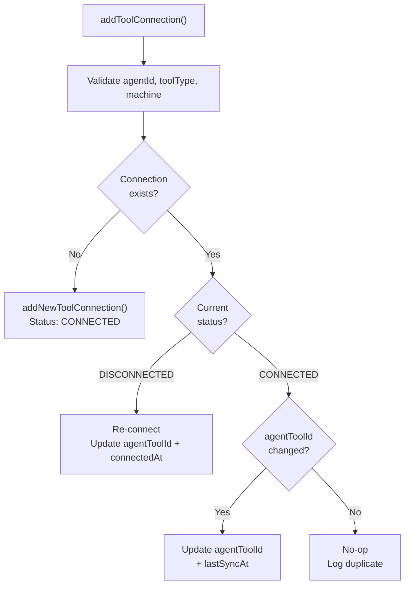

<!-- source-hash: 7b59c1cacda2b1f6a49f84c85956717f -->
Manages the lifecycle of tool connections between OpenFrame agents and registered machines, handling creation, updates, and deduplication of `ToolConnection` records within a transactional context.

## Key Components

| Method | Description |
|--------|-------------|
| `addToolConnection` | Entry point — validates inputs, resolves tool type, then upserts the connection record |
| `processExistingToolConnection` | Handles reconnection of a `DISCONNECTED` tool or updates the `agentToolId` if it changed on an already `CONNECTED` tool |
| `addNewToolConnection` | Creates and persists a brand-new `ToolConnection` with `CONNECTED` status |
| `validateAgentId` | Guards against null or blank agent IDs (`InvalidAgentIdException`) |
| `validateToolType` | Guards against null or blank tool type strings (`InvalidToolTypeException`) |
| `validateMachineExists` | Confirms the machine is registered before proceeding (`MachineNotFoundException`) |
| `getToolTypeFromString` | Case-insensitive enum resolution from a raw string value |

## Usage Example

```java
// Triggered during agent registration or tool heartbeat
toolConnectionService.addToolConnection(
    "agent-abc-123",   // OpenFrame agent ID
    "RMMAGENT",        // Raw tool type string (resolved to ToolType enum)
    "rmm-tool-999",    // Tool-side agent identifier
    true               // Whether this is the last registration attempt
);
```

## Connection Update Logic



> **Note:** The `agentToolId` is always passed through `ToolAgentIdTransformerService.transform()` before being persisted, allowing tool-specific ID normalization per `ToolType`.