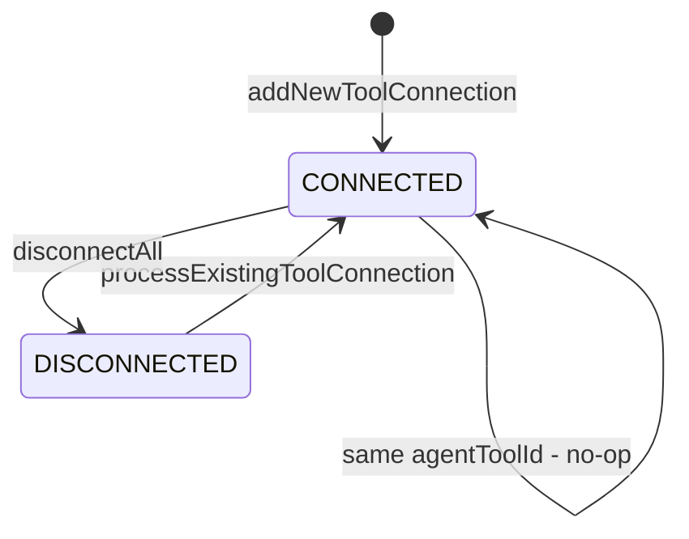

<!-- source-hash: 10202bee4a7a3a1da429fc6fcf84f5f9 -->
Manages the lifecycle of tool connections between OpenFrame agents and MSP tools, handling creation, updates, and disconnection of `ToolConnection` records with transactional safety.

## Key Components

| Method | Description |
|---|---|
| `disconnectAll(String machineId)` | Marks all active tool connections for a given machine as `DISCONNECTED` |
| `addToolConnection(...)` | Upserts a tool connection for an agent — creates new or updates existing based on current state |
| `processExistingToolConnection(...)` | Handles reconnection or `agentToolId` drift on an already-tracked connection |
| `addNewToolConnection(...)` | Persists a brand-new `ToolConnection` record with `CONNECTED` status |
| `validateAgentId / validateToolType / validateMachineExists` | Guards that throw `InvalidAgentIdException`, `InvalidToolTypeException`, or `MachineNotFoundException` |
| `getToolTypeFromString(...)` | Safely parses a raw string into a `ToolType` enum value |

## Usage Example

```java
// Register a new tool connection during agent handshake
toolConnectionService.addToolConnection(
    "agent-uuid-1234",   // openframeAgentId
    "RMMAGENT",          // toolTypeValue (resolved to ToolType enum)
    "rmm-tool-id-5678",  // agentToolId from the upstream tool
    true                 // lastAttempt flag passed to ID transformer
);

// Disconnect all tools when a machine goes offline
toolConnectionService.disconnectAll("agent-uuid-1234");
```

## State Transition Logic


```mermaid
stateDiagram-v2
    [*] --> CONNECTED: addNewToolConnection
    DISCONNECTED --> CONNECTED: processExistingToolConnection
    CONNECTED --> CONNECTED: agentToolId changed - update sync timestamp
    CONNECTED --> CONNECTED: same agentToolId - no-op
    CONNECTED --> DISCONNECTED: disconnectAll
```

## Notes

- All write operations run under `@Transactional` to prevent partial updates.
- `ToolAgentIdTransformerService` is applied on every write, allowing tool-specific ID normalization before persistence.
- The `lastAttempt` flag is forwarded to the transformer — useful for finalizing ID resolution on the last retry of a registration sequence.