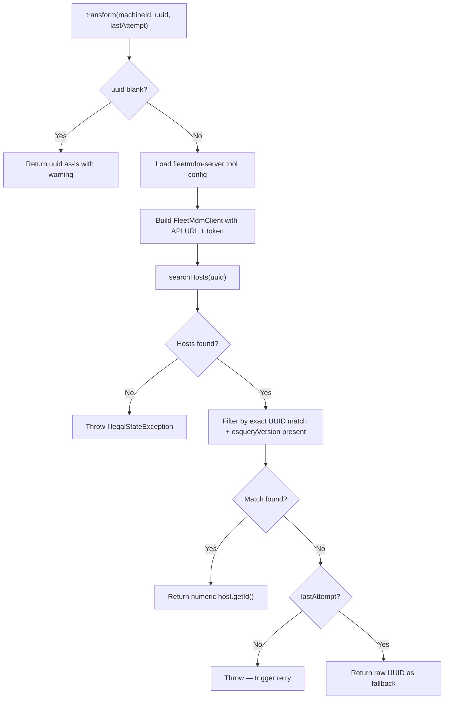

<!-- source-hash: bb8172c8767631fed631b3d7aa30dbc7 -->
Transforms a Fleet MDM agent's UUID into its numeric host ID by querying the Fleet MDM API during agent registration.

## Key Components

| Member | Type | Description |
|--------|------|-------------|
| `TOOL_ID` | Constant | Identifies the Fleet MDM tool (`"fleetmdm-server"`) used for config lookup |
| `getToolType()` | Method | Returns `ToolType.FLEET_MDM` to associate this transformer with Fleet MDM |
| `transform()` | Method | Core logic — resolves a UUID to a Fleet MDM numeric host ID |
| `processMatchingHost()` | Method | Extracts and logs the numeric `host.getId()` from a matched host |
| `processNoMatchingHost()` | Method | Handles the no-match case; on final attempt falls back to the raw UUID |
| `integratedToolService` | Dependency | Retrieves the `fleetmdm-server` tool configuration and credentials |
| `toolUrlService` | Dependency | Resolves the API base URL and port for the Fleet MDM instance |

## Usage Example

```java
// Injected as part of the agent registration transformer chain
FleetMdmAgentIdTransformer transformer = new FleetMdmAgentIdTransformer(
    integratedToolService,
    toolUrlService
);

// agentToolId is the Fleet MDM UUID from the registering agent
String numericHostId = transformer.transform(
    "machine-abc-123",   // machineId
    "550e8400-e29b-...", // agentToolId (UUID)
    false                // lastAttempt
);
// Returns "42" (the Fleet MDM numeric host ID)
```

## Transform Flow



**Selection strategy:** When multiple UUID-matched hosts exist, the one with the most recent `lastEnrolledAt` timestamp and a non-blank `osqueryVersion` wins.