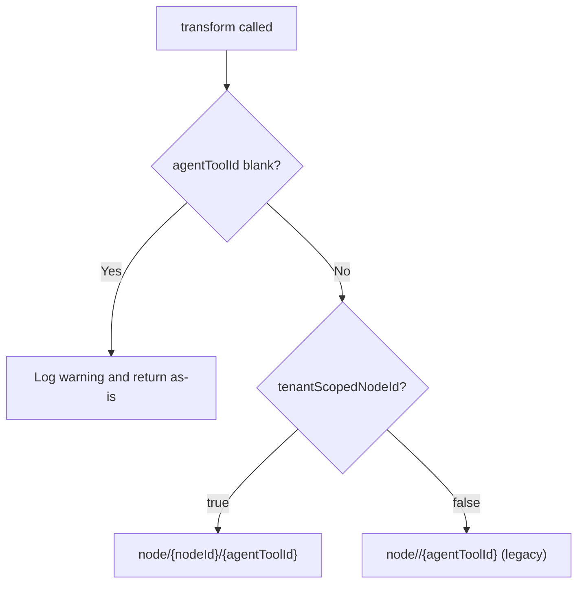

<!-- source-hash: 358c51fd57c074c16cf242321b539728 -->
Transforms raw MeshCentral agent tool IDs into fully-qualified node path strings, supporting both legacy and tenant-scoped node ID formats.

## Key Components

| Member | Type | Description |
|---|---|---|
| `getToolType()` | Method | Returns `ToolType.MESHCENTRAL`, binding this transformer to MeshCentral agents |
| `transform()` | Method | Converts a raw `agentToolId` into a node-path string |
| `nodeId` | Config property | Injected via `openframe.client.meshcentral.node-id` |
| `tenantScopedNodeId` | Config property | Injected via `openframe.client.meshcentral.tenant-scoped-node-id` (default: `false`) |
| `LEGACY_NODE_PREFIX` | Constant | `"node//"` — prefix used when tenant scoping is disabled |

### Transform Logic



## Usage Example

```java
// Tenant-scoped mode (openframe.client.meshcentral.tenant-scoped-node-id=true)
// openframe.client.meshcentral.node-id=acme
transformer.transform("machine-123", "abc456", false);
// → "node/acme/abc456"

// Legacy mode (default)
transformer.transform("machine-123", "abc456", false);
// → "node//abc456"

// Blank agent tool ID (no-op with warning logged)
transformer.transform("machine-123", "", false);
// → ""
```

## Configuration

```yaml
openframe:
  client:
    meshcentral:
      node-id: "your-tenant-node-id"
      tenant-scoped-node-id: true   # false = legacy "node//" prefix
```

> **Note:** The legacy `node//` format is kept as the default pending a MeshCentral release. Once migrated, `tenant-scoped-node-id` should become the standard and the legacy path removed.