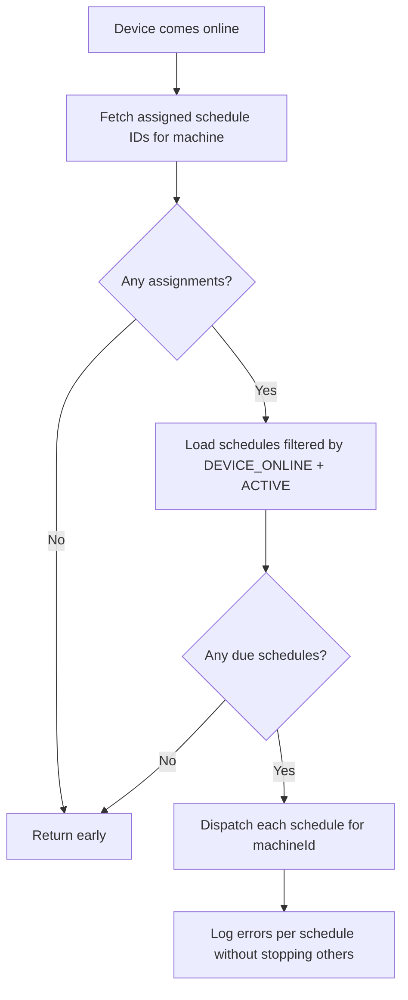

<!-- source-hash: 2ff9c7ea319b9a0339e0f36c492a271f -->
Handles the `DEVICE_ONLINE` trigger type for script schedules in the RMM module. When a monitored device transitions from offline to online, this service identifies and immediately fires all active schedules assigned to that machine that are configured with the `DEVICE_ONLINE` trigger.

## Key Components

| Component | Description |
|---|---|
| `onDeviceOnline(tenantId, machineId)` | Entry point called when a device comes online; resolves and fires eligible schedules for the given tenant/machine pair |
| `ScriptScheduleMachineAssignedRepository` | Looks up schedule assignments scoped to the specific machine |
| `ScriptScheduleRepository` | Fetches schedule definitions, filtered by `DEVICE_ONLINE` trigger and `ACTIVE` status |
| `ScheduleFireDispatcher` | Dispatches each qualifying schedule execution targeting only the online machine |

## Execution Flow



## Usage Example

```java
// Called from device presence/heartbeat handler when offline→online transition is detected
@EventListener
public void handleDeviceStatusChange(DeviceStatusEvent event) {
    if (event.isNowOnline()) {
        deviceOnlineScheduleTriggerService.onDeviceOnline(
            event.getTenantId(),
            event.getMachineId()
        );
    }
}
```

## Notes

- Per-schedule errors are caught and logged individually; one failure does not prevent remaining schedules from firing.
- Only schedules with both `trigger == DEVICE_ONLINE` and `status == ACTIVE` are dispatched.
- Execution is scoped strictly to the single machine that came online — no other assigned machines are affected.

**Source:** [`DeviceOnlineScheduleTriggerService.java`](https://github.com/flamingo-stack/openframe-oss-lib/blob/main/src/main/java/com/openframe/client/service/rmm/DeviceOnlineScheduleTriggerService.java)