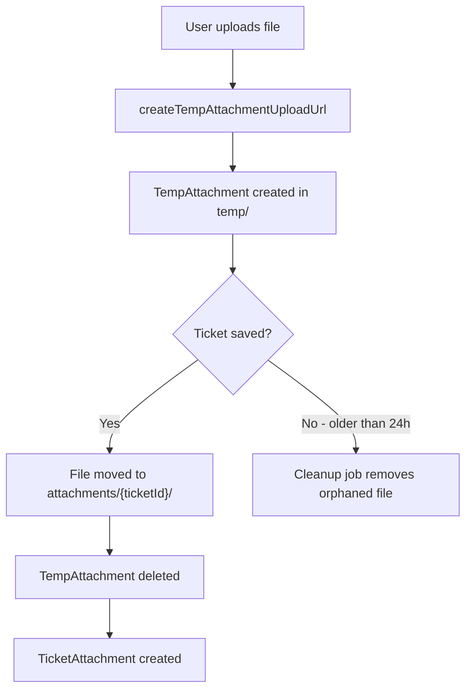

<!-- source-hash: 264a1d8e2d5dadffd20074e411e5bc40 -->
Represents a temporary file attachment uploaded before a ticket is created, following the "Temp Upload Pattern" used by platforms like Gmail, Slack, and GitHub.

## Key Components

| Field | Type | Description |
|-------|------|-------------|
| `id` | `String` | MongoDB document ID |
| `tenantId` | `String` | Tenant identifier (indexed, implements `TenantScoped`) |
| `fileName` | `String` | Original name of the uploaded file |
| `contentType` | `String` | MIME type of the file |
| `fileSize` | `Long` | Size of the file in bytes |
| `storagePath` | `String` | S3 key in format `temp/{tempId}/{fileName}` |
| `uploadedBy` | `String` | ID of the user who initiated the upload |
| `createdAt` | `Instant` | Auto-set creation timestamp used for orphan cleanup |

## Upload Lifecycle



## Usage Example

```java
TempAttachment temp = TempAttachment.builder()
    .tenantId("tenant-123")
    .fileName("screenshot.png")
    .contentType("image/png")
    .fileSize(204800L)
    .storagePath("temp/abc-uuid/screenshot.png")
    .uploadedBy("user-456")
    .build();

tempAttachmentRepository.save(temp);
```

## Notes

- Stored in MongoDB collection `temp_attachments`
- A scheduled cleanup job runs every **6 hours**, deleting any `TempAttachment` with a `createdAt` older than **24 hours**, preventing orphaned S3 objects from accumulating