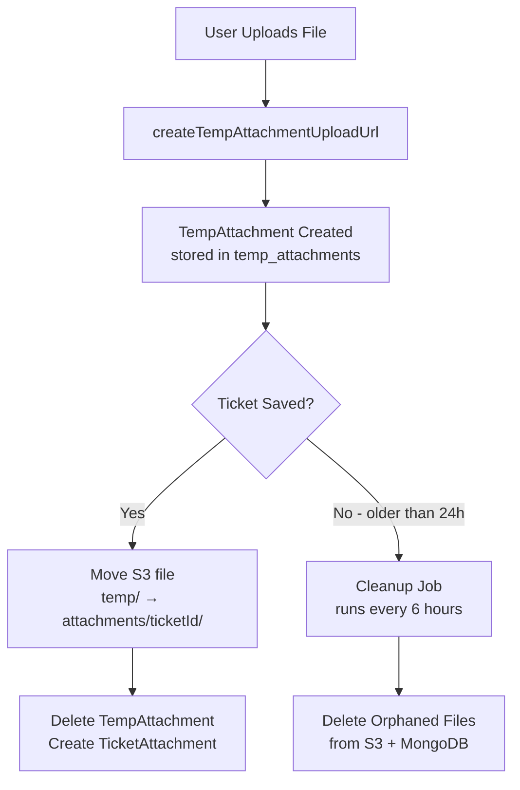

<!-- source-hash: 6bfd562f47ac16597e260202f5d4ef6c -->
MongoDB document entity representing a temporary file attachment uploaded before ticket creation, implementing the "Temp Upload Pattern" used by platforms like Gmail and Slack.

## Key Components

| Field | Type | Description |
|-------|------|-------------|
| `id` | `String` | MongoDB document identifier (`@Id`) |
| `fileName` | `String` | Original name of the uploaded file |
| `contentType` | `String` | MIME type of the file |
| `fileSize` | `Long` | Size of the file in bytes |
| `storagePath` | `String` | S3 key in format `temp/{tempId}/{fileName}` |
| `uploadedBy` | `String` | ID of the user who initiated the upload |
| `createdAt` | `Instant` | Auto-populated timestamp, indexed for cleanup queries |

## Lifecycle Flow



## Usage Example

```java
// Step 1: Create temp attachment on upload initiation
TempAttachment tempAttachment = TempAttachment.builder()
    .fileName("network-diagram.png")
    .contentType("image/png")
    .fileSize(204800L)
    .storagePath("temp/abc123/network-diagram.png")
    .uploadedBy("user-456")
    .build();

tempAttachmentRepository.save(tempAttachment);

// Step 2: Query orphaned attachments for cleanup
Instant cutoff = Instant.now().minus(24, ChronoUnit.HOURS);
List<TempAttachment> orphaned = repository.findByCreatedAtBefore(cutoff);
```

> **Note:** The `createdAt` field is indexed to optimize the cleanup job query that runs every 6 hours, identifying orphaned uploads older than 24 hours.