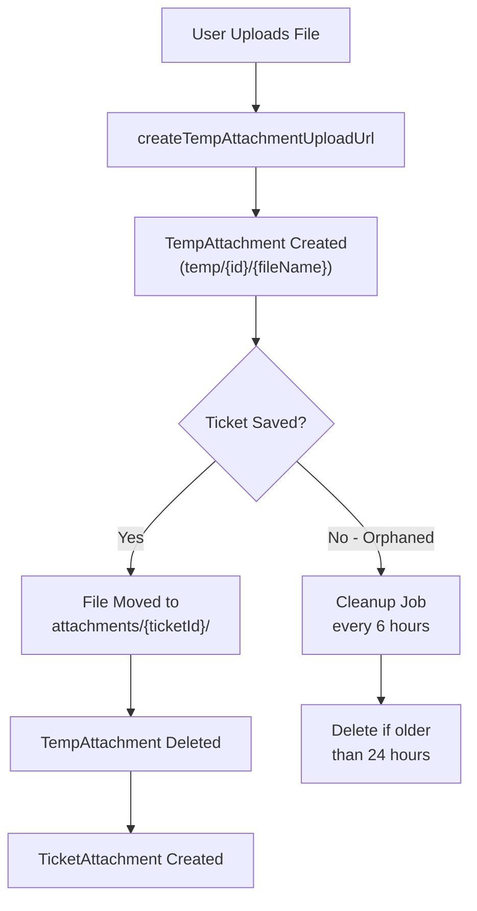

<!-- source-hash: 264a1d8e2d5dadffd20074e411e5bc40 -->
Represents a temporary file attachment uploaded before a ticket is fully created, following the "Temp Upload Pattern" used by platforms like Gmail, Slack, and GitHub.

## Key Components

| Field | Type | Description |
|-------|------|-------------|
| `id` | `String` | MongoDB document identifier |
| `tenantId` | `String` | Tenant scope (indexed) |
| `fileName` | `String` | Original file name |
| `contentType` | `String` | MIME type of the uploaded file |
| `fileSize` | `Long` | File size in bytes |
| `storagePath` | `String` | S3 key in format `temp/{tempId}/{fileName}` |
| `uploadedBy` | `String` | User who initiated the upload |
| `createdAt` | `Instant` | Auto-set creation time; used for orphan cleanup |

## Lifecycle



## Usage Example

```java
TempAttachment temp = TempAttachment.builder()
    .tenantId("tenant-123")
    .fileName("screenshot.png")
    .contentType("image/png")
    .fileSize(204800L)
    .storagePath("temp/abc-xyz/screenshot.png")
    .uploadedBy("user-456")
    .build();

tempAttachmentRepository.save(temp);
```

> **Cleanup:** A scheduled job runs every 6 hours and deletes any `TempAttachment` records (and their corresponding S3 objects) with a `createdAt` older than 24 hours, preventing orphaned storage accumulation.