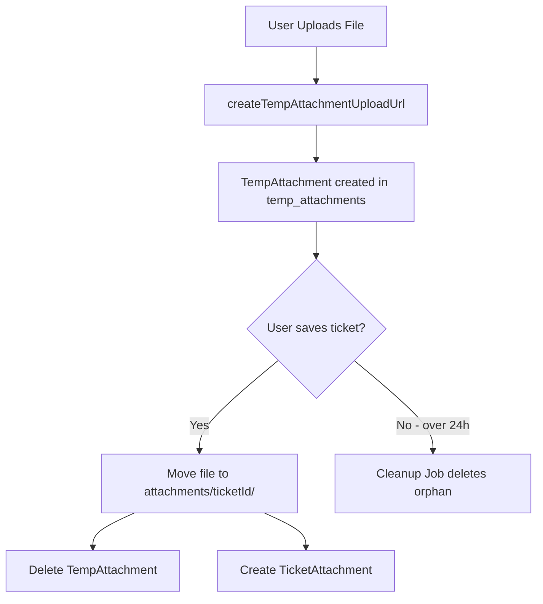

<!-- source-hash: 264a1d8e2d5dadffd20074e411e5bc40 -->
Represents a temporary file attachment uploaded before a ticket is created, implementing the "Temp Upload Pattern" used by platforms like Gmail, Slack, and GitHub. Stored in MongoDB and automatically cleaned up if orphaned.

## Key Components

| Field | Type | Description |
|---|---|---|
| `id` | `String` | MongoDB document identifier |
| `tenantId` | `String` | Tenant scope identifier (indexed) |
| `fileName` | `String` | Original name of the uploaded file |
| `contentType` | `String` | MIME type of the file |
| `fileSize` | `Long` | File size in bytes |
| `storagePath` | `String` | S3 key in format `temp/{tempId}/{fileName}` |
| `uploadedBy` | `String` | User ID who initiated the upload |
| `createdAt` | `Instant` | Auto-set creation timestamp; used by cleanup job |

**Implements:** `TenantScoped` — enforces multi-tenant data isolation.

**Collection:** `temp_attachments`

## Upload Lifecycle


```mermaid
graph TD
    A[User Uploads File] --> B[createTempAttachmentUploadUrl]
    B --> C[TempAttachment created in temp_attachments]
    C --> D{User saves ticket?}
    D -->|Yes| E[Move file to attachments/ticketId/]
    E --> F[Delete TempAttachment]
    E --> G[Create TicketAttachment]
    D -->|No - over 24h| H[Cleanup Job deletes orphan]
```

## Usage Example

```java
TempAttachment tempAttachment = TempAttachment.builder()
    .tenantId("tenant-123")
    .fileName("screenshot.png")
    .contentType("image/png")
    .fileSize(204800L)
    .storagePath("temp/abc-uuid/screenshot.png")
    .uploadedBy("user-456")
    .build();

tempAttachmentRepository.save(tempAttachment);
```

> **Cleanup:** A scheduled job runs every 6 hours and deletes any `TempAttachment` records (and their corresponding S3 objects) where `createdAt` is older than 24 hours, preventing storage bloat from abandoned uploads.

## Source

[`TempAttachment.java`](https://github.com/flamingo-stack/openframe-oss-lib/blob/main/src/main/java/com/openframe/data/document/ticket/TempAttachment.java)