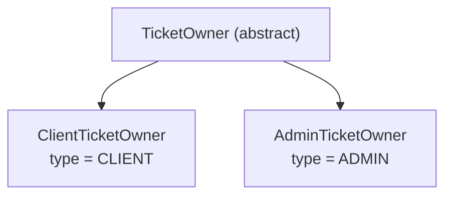

<!-- source-hash: b407b123dd93d336619584eea955b6e2 -->
Abstract base class for ticket ownership in the OpenFrame platform, defining a polymorphic owner model that distinguishes between client and admin ticket ownership using Jackson type discrimination.

## Key Components

| Component | Description |
|-----------|-------------|
| `TicketOwner` | Abstract base class representing a ticket owner entity |
| `TicketOwnerType type` | MongoDB-mapped field storing the discriminator enum value |
| `@JsonTypeInfo` | Enables polymorphic JSON deserialization using a `type` property |
| `@JsonSubTypes` | Maps `"CLIENT"` → `ClientTicketOwner` and `"ADMIN"` → `AdminTicketOwner` |

## Usage Example

```java
// Serialization — Jackson includes the "type" discriminator automatically
TicketOwner owner = new ClientTicketOwner();
String json = objectMapper.writeValueAsString(owner);
// Output: {"type":"CLIENT", ...}

// Deserialization — Jackson resolves the correct subtype
String payload = "{\"type\":\"ADMIN\", ...}";
TicketOwner owner = objectMapper.readValue(payload, TicketOwner.class);
// Returns: AdminTicketOwner instance

// Polymorphic usage in a ticket document
Ticket ticket = new Ticket();
ticket.setOwner(new ClientTicketOwner(...));
mongoTemplate.save(ticket);
```

## Subtype Hierarchy



> **Note:** Subclasses must be concrete implementations of `TicketOwner`. The `type` field is persisted in MongoDB under the field name `ticketOwnerType` and doubles as the Jackson polymorphic type identifier.