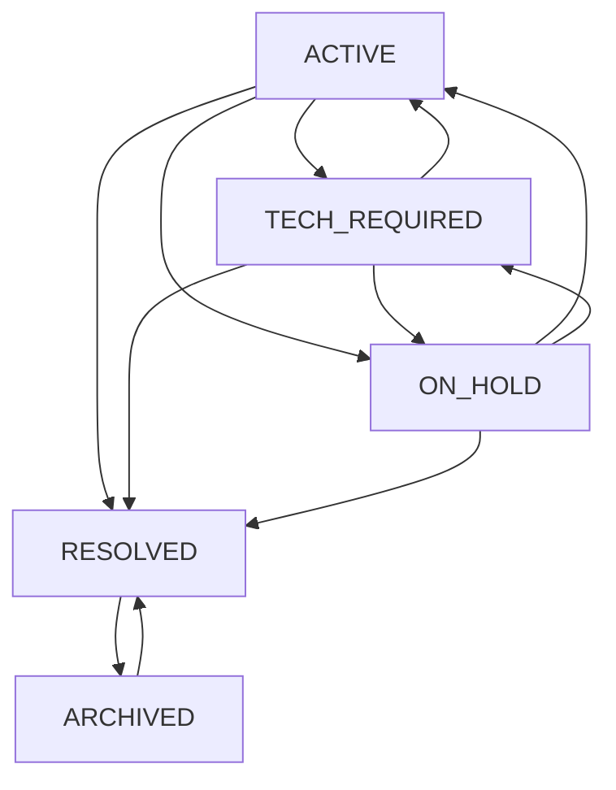

<!-- source-hash: b7ecc3da01fee9e7da9ee11d5950930f -->
Enum defining the lifecycle states of a support ticket in the OpenFrame platform, with enforced transition rules that mirror the Figma-designed ticket flow.

## Key Components

| Member | Type | Description |
|--------|------|-------------|
| `ACTIVE` | State | Ticket is open and being handled |
| `TECH_REQUIRED` | State | Ticket requires technician intervention |
| `ON_HOLD` | State | Ticket is paused pending action |
| `RESOLVED` | State | Ticket has been closed/resolved |
| `ARCHIVED` | State | Ticket is permanently archived |
| `canTransitionTo(TicketStatus)` | Method | Returns `true` if transitioning to the target state is permitted |
| `getAllowedTransitions()` | Method | Returns the set of valid next states from the current state |

## Transition Map



## Usage Example

```java
TicketStatus current = TicketStatus.ACTIVE;

// Check if a transition is valid before applying it
if (current.canTransitionTo(TicketStatus.RESOLVED)) {
    ticket.setStatus(TicketStatus.RESOLVED);
}

// Inspect all valid next states
Set<TicketStatus> next = current.getAllowedTransitions();
// → [TECH_REQUIRED, ON_HOLD, RESOLVED]

// Guard against invalid transitions
if (!current.canTransitionTo(TicketStatus.ARCHIVED)) {
    throw new IllegalStateException("Cannot archive an active ticket directly.");
}
```

> **Note:** `TicketStatus` is intentionally separate from `DialogStatus` to allow independent feature flag control over ticket lifecycle behavior.