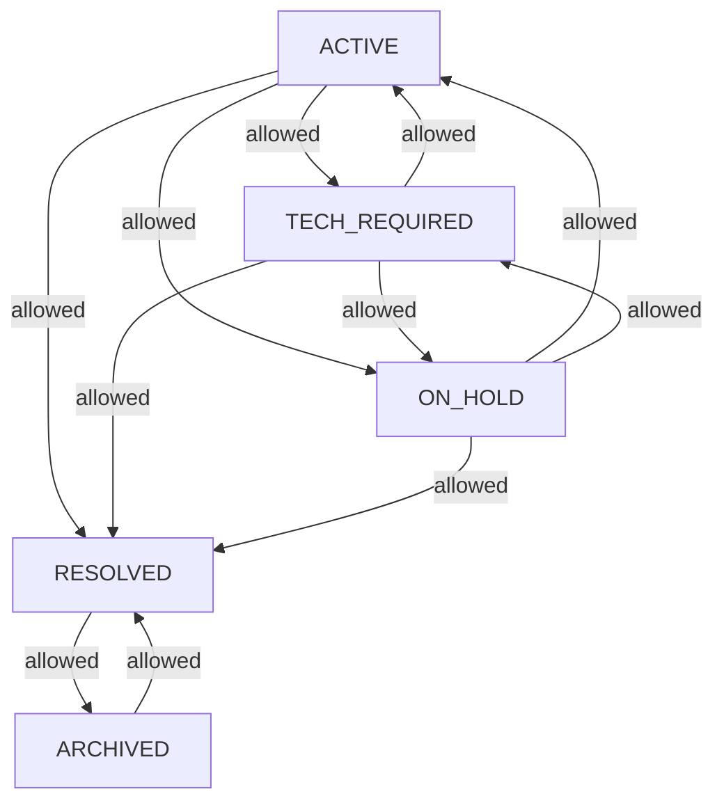

<!-- source-hash: 048e7373f78829118b57d3244ca9ea82 -->
Enum representing the lifecycle states of a ticket in the OpenFrame platform, modeling valid status transitions aligned with the Figma flow design. Kept separate from `DialogStatus` for feature flag isolation.

## Key Components

| Member | Description |
|--------|-------------|
| `ACTIVE` | Ticket is open and being worked on |
| `TECH_REQUIRED` | Ticket needs technician assignment |
| `ON_HOLD` | Ticket is paused |
| `RESOLVED` | Ticket has been closed/resolved |
| `ARCHIVED` | Ticket is archived after resolution |
| `canTransitionTo(TicketStatus)` | Returns `true` if the transition from current to target state is permitted |
| `getAllowedTransitions()` | Returns the `Set` of valid next states for each status |

## Transition Graph



## Usage Example

```java
TicketStatus current = TicketStatus.ACTIVE;

// Check if a specific transition is valid
if (current.canTransitionTo(TicketStatus.ON_HOLD)) {
    ticket.setStatus(TicketStatus.ON_HOLD);
}

// Inspect all valid next states
Set<TicketStatus> next = current.getAllowedTransitions();
// → [TECH_REQUIRED, ON_HOLD, RESOLVED]
```

> **Note:** This enum is marked for removal (`TODO: lifecycle-rollout`) once the legacy `status` field is dropped from the `Ticket` document model.