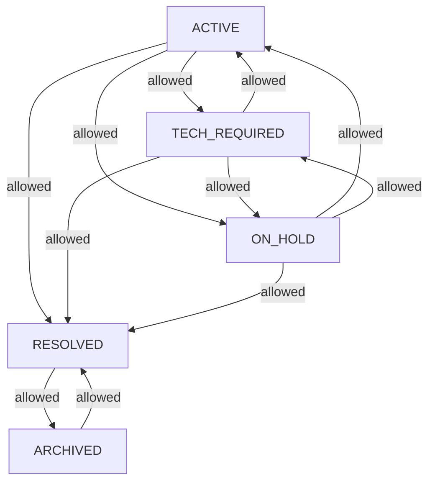

<!-- source-hash: 048e7373f78829118b57d3244ca9ea82 -->
Defines the lifecycle states of a support ticket in OpenFrame, modeling valid status transitions that match the Figma-designed ticket flow. Intentionally separate from `DialogStatus` for feature flag isolation.

## Key Components

- **`TicketStatus` (enum)** — Five lifecycle states: `ACTIVE`, `TECH_REQUIRED`, `ON_HOLD`, `RESOLVED`, `ARCHIVED`
- **`canTransitionTo(TicketStatus target)`** — Returns `true` if a transition to the given status is permitted from the current state
- **`getAllowedTransitions()`** — Returns the `Set` of valid next states for each status, enforcing a strict directed graph

### Transition Map



## Usage Example

```java
TicketStatus current = TicketStatus.ACTIVE;

// Check if a transition is valid before applying it
if (current.canTransitionTo(TicketStatus.RESOLVED)) {
    ticket.setStatus(TicketStatus.RESOLVED);
} else {
    throw new IllegalStateException("Invalid status transition");
}

// Inspect all valid next states
Set<TicketStatus> next = current.getAllowedTransitions();
// → [TECH_REQUIRED, ON_HOLD, RESOLVED]
```

> **Note:** This enum is marked for removal after the legacy `status` field is dropped from the `Ticket` document (`lifecycle-rollout` TODO).