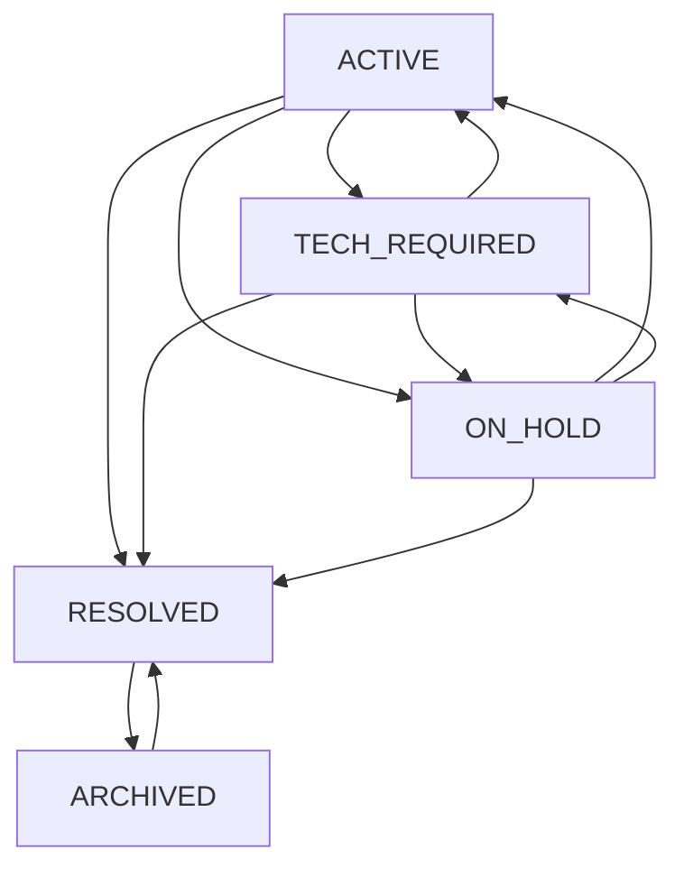

<!-- source-hash: 048e7373f78829118b57d3244ca9ea82 -->
Enum defining the lifecycle states of a support ticket in the OpenFrame platform, with built-in transition validation matching the Figma-designed workflow.

## Key Components

| Member | Type | Description |
|---|---|---|
| `ACTIVE` | Constant | Ticket is open and being worked on |
| `TECH_REQUIRED` | Constant | Ticket needs technician assignment |
| `ON_HOLD` | Constant | Ticket is paused pending external action |
| `RESOLVED` | Constant | Ticket has been resolved |
| `ARCHIVED` | Constant | Ticket is closed and archived |
| `canTransitionTo(TicketStatus)` | Method | Returns `true` if a transition to the target status is permitted |
| `getAllowedTransitions()` | Method | Returns the `Set` of valid next statuses for the current state |

**Transition Map:**


```mermaid
graph TD
    ACTIVE --> TECH_REQUIRED
    ACTIVE --> ON_HOLD
    ACTIVE --> RESOLVED
    TECH_REQUIRED --> ACTIVE
    TECH_REQUIRED --> ON_HOLD
    TECH_REQUIRED --> RESOLVED
    ON_HOLD --> ACTIVE
    ON_HOLD --> TECH_REQUIRED
    ON_HOLD --> RESOLVED
    RESOLVED --> ARCHIVED
    ARCHIVED --> RESOLVED
```

## Usage Example

```java
TicketStatus current = TicketStatus.ACTIVE;

// Check if a transition is valid before applying it
if (current.canTransitionTo(TicketStatus.RESOLVED)) {
    ticket.setStatus(TicketStatus.RESOLVED);
}

// Inspect all valid next states
Set<TicketStatus> next = current.getAllowedTransitions();
// -> [TECH_REQUIRED, ON_HOLD, RESOLVED]
```

> **Note:** This enum is intentionally separate from `DialogStatus` for feature flag isolation and is marked for removal once the legacy `status` field is dropped from the `Ticket` document. See the `TODO(lifecycle-rollout)` annotation in the [source file](https://github.com/flamingo-stack/openframe-oss-lib/blob/main/src/main/java/com/openframe/data/document/ticket/TicketStatus.java).