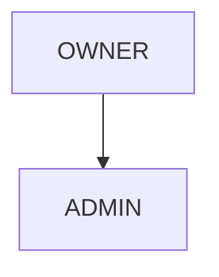

<!-- source-hash: 5a3c7284349e617732f3e793d007432d -->
Defines the `UserRole` enum representing user permission levels within the OpenFrame platform, with a utility method for computing effective roles based on role hierarchy.

## Key Components

| Member | Type | Description |
|--------|------|-------------|
| `ADMIN` | Enum constant | Standard administrative role |
| `OWNER` | Enum constant | Elevated role that implicitly includes `ADMIN` privileges |
| `effective(Collection<UserRole>)` | Static method | Returns the full set of effective roles, automatically adding `ADMIN` when `OWNER` is present |

## Role Hierarchy



`OWNER` implies `ADMIN`, but MongoDB persists only the explicitly granted roles. The `effective()` method resolves the full privilege set at runtime without altering stored data.

## Usage Example

```java
// User stored in MongoDB with only OWNER granted
Set<UserRole> granted = Set.of(UserRole.OWNER);

// Resolve effective roles at runtime
Set<UserRole> effective = UserRole.effective(granted);
// effective → [OWNER, ADMIN]

// Null-safe: returns empty set if no roles granted
Set<UserRole> none = UserRole.effective(null);
// none → []
```

## Notes

- Insertion order is preserved via `LinkedHashSet`
- The `granted` collection is never mutated; a new set is always returned
- Role expansion logic lives here rather than in the persistence layer, keeping MongoDB documents minimal