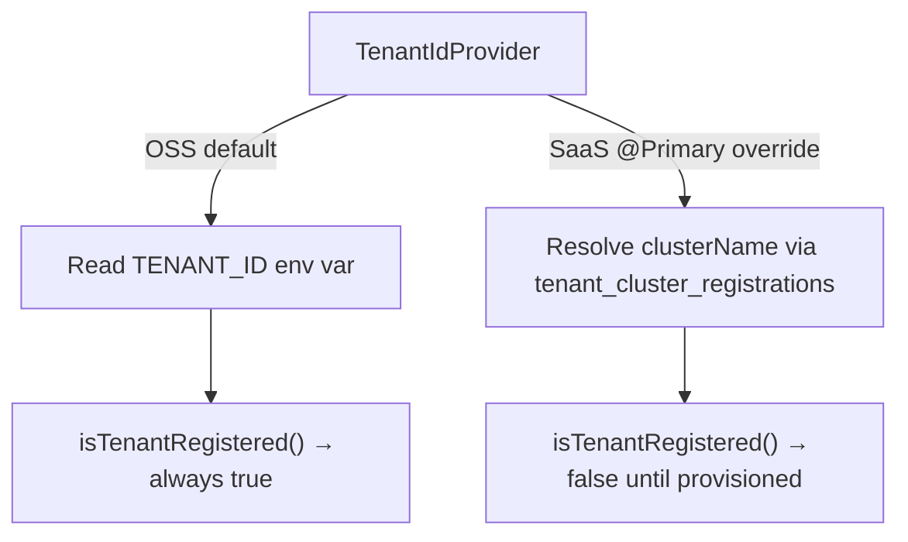

<!-- source-hash: 21b789f02ca95bd18c0ae9c9258c6cc8 -->
Defines the contract for resolving the current pod's tenant identity, supporting both OSS (environment variable) and SaaS (cluster-registration-based) deployment modes.

## Key Components

| Member | Type | Description |
|--------|------|-------------|
| `getTenantId()` | `String` | Returns the tenant ID for the running pod |
| `isTenantRegistered()` | `default boolean` | Checks if the tenant is registered and ready; defaults to `true` for OSS |

## Deployment Behavior



## Usage Example

```java
@Service
public class MyService {

    private final TenantIdProvider tenantIdProvider;

    public MyService(TenantIdProvider tenantIdProvider) {
        this.tenantIdProvider = tenantIdProvider;
    }

    public void process() {
        if (!tenantIdProvider.isTenantRegistered()) {
            throw new IllegalStateException("Tenant not yet provisioned");
        }
        String tenantId = tenantIdProvider.getTenantId();
        // use tenantId for scoped queries, logging, etc.
    }
}
```

## Notes

- The OSS default implementation reads from the `TENANT_ID` environment variable — no registration lookup required.
- SaaS deployments inject a `@Primary` bean that performs a database lookup in `tenant_cluster_registrations` to resolve `clusterName → tenantId`.
- `isTenantRegistered()` is a `default` method, so OSS implementations need not override it.