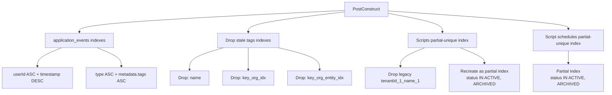

<!-- source-hash: 2297fa05b6cd3b49e6209da83090f26d -->
Configures and manages MongoDB indexes for the OpenFrame data layer, ensuring proper indexing on application events, tags, scripts, and script schedules during application startup.

## Key Components

| Component | Description |
|---|---|
| `initIndexes()` | `@PostConstruct` method that creates/ensures all required indexes and drops stale legacy indexes |
| `dropStaleIndex()` | Helper that silently drops a named index, logging at `INFO` on success and `DEBUG` if absent |
| `SCRIPTS_NAME_UNIQUE_INDEX` | Named partial-unique index on `scripts`: `(tenantId, name)` scoped to non-deleted statuses |
| `SCRIPT_SCHEDULES_NAME_UNIQUE_INDEX` | Named partial-unique index on `script_schedules`: same semantics as scripts |

## Index Strategy



## Usage Example

This class is auto-configured by Spring — no manual wiring required. The partial index pattern used here allows soft-deleted records' names to be reused:

```java
// Partial index filter: name uniqueness applies ONLY to non-deleted statuses.
// MongoDB 6.3+ supports $in in partial index filters; $ne/$not are rejected (error 67).
new Index()
    .on("tenantId", Sort.Direction.ASC)
    .on("name", Sort.Direction.ASC)
    .unique()
    .named("scripts_tenant_name_notDeleted_unique")
    .partial(PartialIndexFilter.of(
        Criteria.where("status")
                .in(ScriptStatus.ACTIVE.name(), ScriptStatus.ARCHIVED.name())
    ));
```

> **Note:** Keep the `ScriptStatus` values in the `$in` filter synchronized with every non-`DELETED` enum value. Adding a new non-deleted status without updating this filter will allow duplicate names for records in that status.

**Source:** [`MongoIndexConfig.java`](https://github.com/flamingo-stack/openframe-oss-lib/blob/main/src/main/java/com/openframe/data/config/MongoIndexConfig.java)