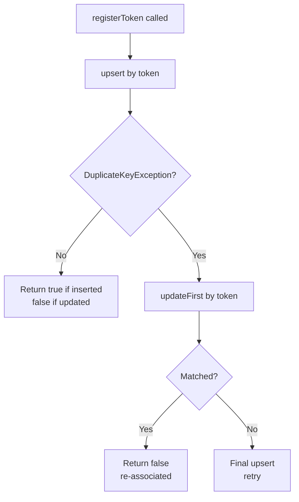

<!-- source-hash: 454cbfe6a69fc97fa574d7e2e88050ca -->
Tenant-aware MongoDB repository implementation for registering and rebinding push notification device tokens. Uses atomic upsert semantics to safely handle concurrent token registration against a `{tenantId, token}` unique index.

## Key Components

| Member | Description |
|---|---|
| `CustomPushDeviceRepositoryImpl` | Extends `TenantAwareRepositorySupport`, implements `CustomPushDeviceRepository` |
| `registerToken(userId, token, platform)` | Atomically inserts or rebinds a push device token to a user; returns `true` if a new record was created |
| `getUpdateQuery(userId, platform, now)` | Builds a reusable `Update` document setting `userId`, `platform`, and `updatedAt` |

**Activation:** Only loaded when `openframe.tenant-isolation.enabled=true`.

## Concurrency Strategy

The implementation uses a three-stage fallback to handle concurrent registrations safely:



## Usage Example

```java
// Injected where push notifications are managed
@Autowired
CustomPushDeviceRepository pushDeviceRepository;

// Register a new FCM token for a user
boolean isNewDevice = pushDeviceRepository.registerToken(
    "user-123",
    "fcm-token-abc456",
    PushPlatform.ANDROID
);

if (isNewDevice) {
    log.info("New device registered for user-123");
} else {
    log.info("Existing device token re-associated to user-123");
}
```

> **Why upsert over save?** `save()` is a read-modify-write and races against concurrent registrations. `upsert` is atomic against the unique index, with `DuplicateKeyException` handling covering the narrow window where two threads attempt simultaneous inserts.

**Source:** [`CustomPushDeviceRepositoryImpl.java`](https://github.com/flamingo-stack/openframe-oss-lib/blob/main/com/openframe/data/repository/push/impl/CustomPushDeviceRepositoryImpl.java)