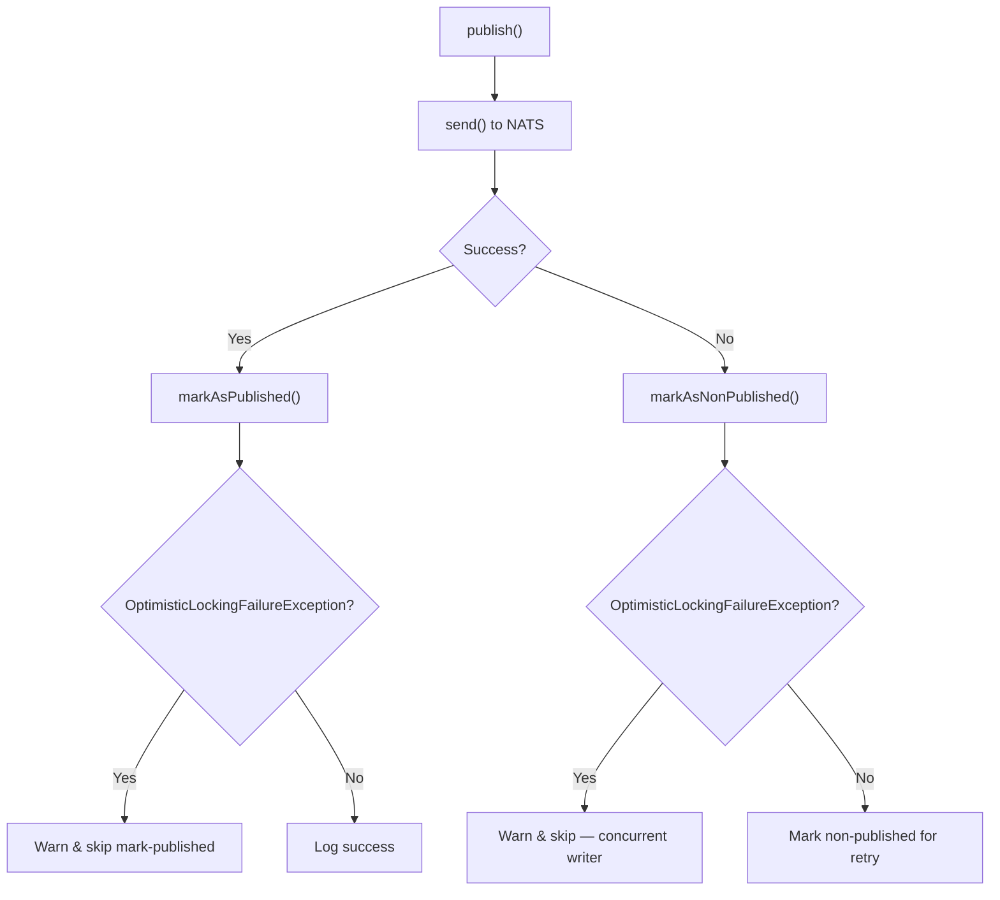

<!-- source-hash: 52a3ed9a986ed47f0078d50d96504124 -->
Publishes OpenFrame client update messages to a NATS persistent topic, handling optimistic locking conflicts and marking configurations as published or non-published based on delivery outcome.

## Key Components

| Member | Type | Description |
|--------|------|-------------|
| `TOPIC_NAME` | Constant | NATS subject `machine.all.client-update` targeted for all machines |
| `publish()` | Method | Orchestrates send + status marking with error recovery |
| `send()` | Method | Builds and dispatches the NATS persistent message |
| `buildMessage()` | Private Method | Maps `OpenFrameClientConfiguration` into `OpenFrameClientUpdateMessage` |

**Dependencies:**

| Dependency | Role |
|------------|------|
| `NatsMessagePublisher` | Low-level NATS persistent publish |
| `DownloadConfigurationMapper` | Maps download config entries to message format |
| `OpenFrameClientConfigurationService` | Marks config as published/non-published in the DB |

> **Conditional activation:** This service is only registered when `spring.cloud.stream.enabled` is set to `true`.

## Usage Example

```java
// Injected by Spring — triggers publish with full lifecycle tracking
@Autowired
private OpenFrameClientUpdatePublisher publisher;

// Publishes configuration to NATS and marks it published on success,
// or marks it non-published on failure for scheduler retry
publisher.publish(openFrameClientConfiguration);

// For fire-and-forget (no DB status tracking), use send() directly
publisher.send(openFrameClientConfiguration);
```

## Error Handling Flow

