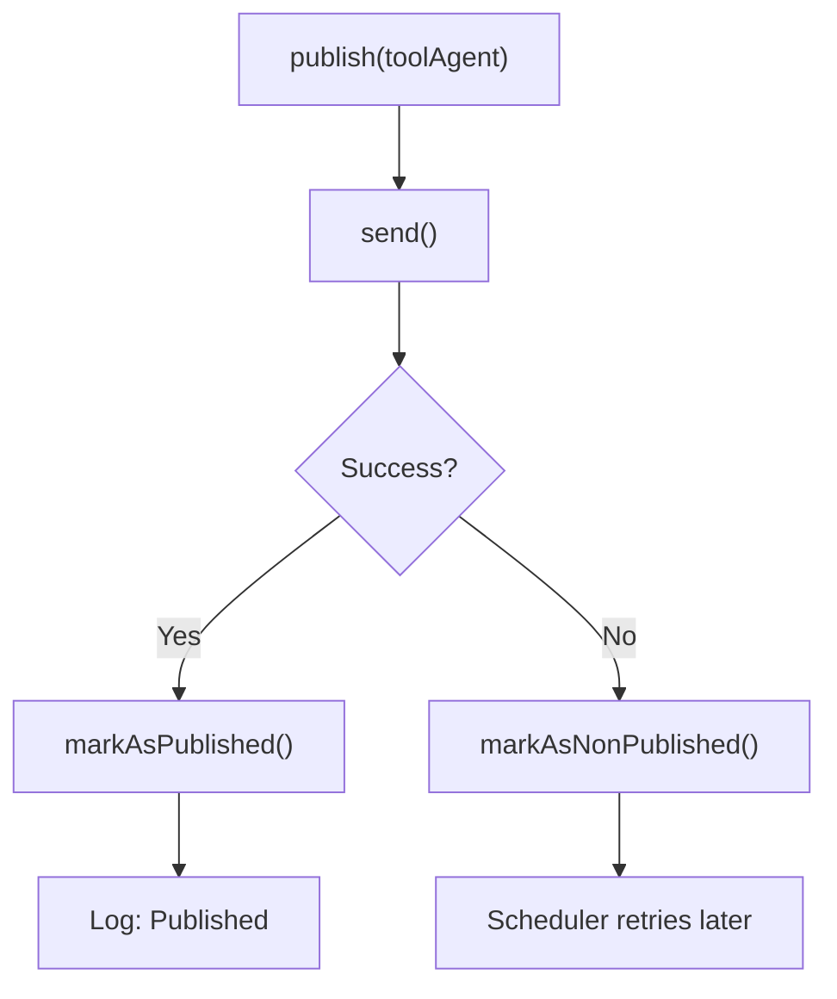

<!-- source-hash: f1b733fa701e98b77782ffd42dc22ca5 -->
Publishes tool agent update messages to NATS persistent subjects, handling optimistic locking conflicts and delegating publish-state tracking to `IntegratedToolAgentService`.

## Key Components

| Member | Type | Description |
|--------|------|-------------|
| `TOPIC_NAME_TEMPLATE` | Constant | Subject pattern `machine.all.tool.<id>.update` used to route messages per tool agent |
| `publish()` | Method | Orchestrates send + state marking; catches exceptions and falls back to `markAsNonPublished` for scheduler retry |
| `send()` | Method | Builds the topic name and `ToolAgentUpdateMessage`, then delegates to `NatsMessagePublisher.publishPersistent()` |
| `buildMessage()` | Method | Assembles a `ToolAgentUpdateMessage` from the `IntegratedToolAgent` document, mapping download configs and assets |
| `mapAssets()` | Method | Converts a list of `ToolAgentAsset` domain objects to `AssetUpdate` DTOs |

> **Activation:** The bean is only created when `spring.cloud.stream.enabled` is set, keeping NATS publishing opt-in per environment.

## Usage Example

```java
// Injected by Spring – typically called from a scheduler or event handler
@Service
@RequiredArgsConstructor
public class ToolAgentUpdateScheduler {

    private final ToolAgentUpdateUpdatePublisher publisher;
    private final IntegratedToolAgentService toolAgentService;

    public void retryUnpublished() {
        toolAgentService.findAllNonPublished().forEach(toolAgent -> {
            // publish() handles send errors and concurrent-write races internally
            publisher.publish(toolAgent);
        });
    }
}
```

```java
// Direct send (no state tracking) – use when publish state is managed externally
publisher.send(toolAgent);
```

**Error handling flow:**

