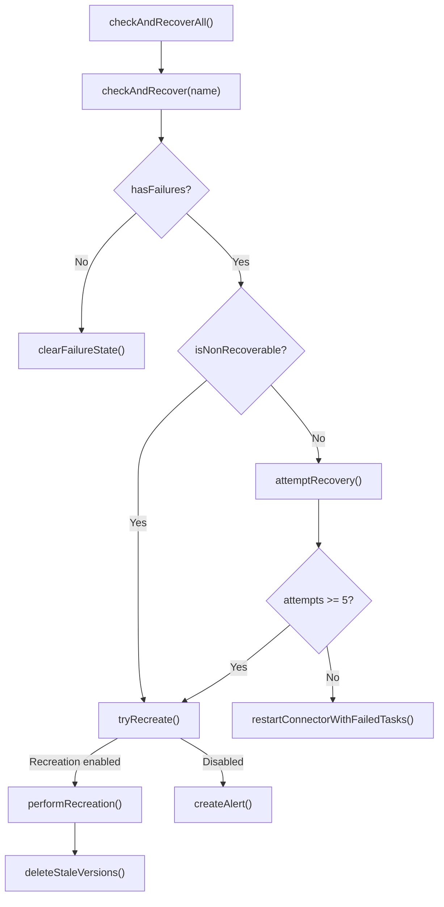

<!-- source-hash: 0682cb50af69c494b1e7770a9632ebf7 -->
Manages automated health checking and fault recovery for Debezium connectors, implementing exponential backoff, non-recoverable error detection, and versioned connector recreation for SaaS shared cluster environments.

## Key Components

| Component | Description |
|-----------|-------------|
| `checkAndRecoverAll()` | Iterates all registered connectors, triggers per-connector health checks, and prunes stale in-memory backoff state |
| `checkAndRecover(String)` | Evaluates a single connector's status, classifies failures as recoverable or non-recoverable, and routes to the appropriate recovery path |
| `attemptRecovery(String)` | Applies exponential backoff and invokes KIP-745 task restarts up to `MAX_RECOVERY_ATTEMPTS` (5) |
| `tryRecreate(String, String, String)` | Recreates a failed connector under a new versioned name when `RecreationTracker` and a non-default `ConnectorNameStrategy` are present |
| `performRecreation(...)` | Reserves a rate-limit slot, creates the new connector, clears failure state, and removes stale versioned connectors |
| `clearFailureState(String)` | Removes in-memory backoff entry and resolves any open MongoDB alert on healthy ticks |
| `NON_RECOVERABLE_ERROR_PATTERNS` | Static set of error class patterns (e.g. `ConfigException`, `Authentication failed`) that skip retry and go directly to recreation or alert |
| `backoffStates` | `ConcurrentHashMap<String, ConnectorBackoffState>` tracking per-connector failure counts and next-eligible-restart timestamps |

## Usage Example

```java
// Injected automatically by Spring — scheduled via @Scheduled or a health-check poller
@Autowired
ConnectorRecoveryManager recoveryManager;

// Poll all connectors (called on a fixed interval)
recoveryManager.checkAndRecoverAll();

// Or target a specific connector by name
recoveryManager.checkAndRecover("psql-tenant-acme-v3");
```



> **Backoff:** Each retry doubles wait time in 2-minute increments (`BACKOFF_INCREMENT_MS`). After 5 consecutive failures, the connector is either recreated (SaaS) or an alert is raised in MongoDB.