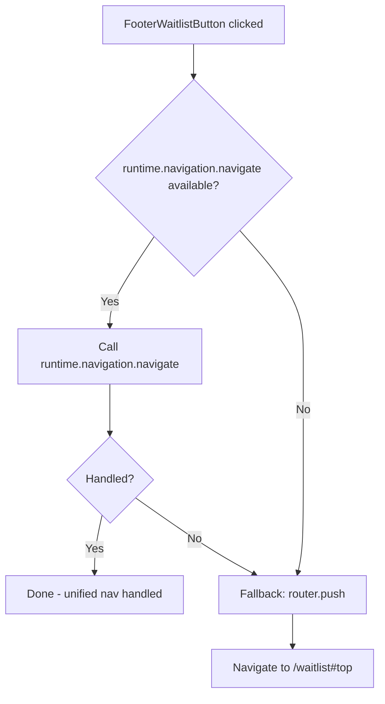

<!-- source-hash: 8e25a68fa3e51dd5cde8b484877f10f2 -->
A footer button component that navigates users to the OpenFrame waitlist page, routing through the unified navigation system when available.

## Key Components

### `FooterWaitlistButtonProps`
- `className?: string` — Optional CSS class for styling overrides.

### `FooterWaitlistButton`
A `Button` wrapper that handles navigation to `/waitlist#top` via a two-tier fallback strategy:

1. **Primary:** `runtime.navigation.navigate` — the host's unified-nav hook (provided by `HubRuntimeProvider`), which handles cross-platform new-tab decisions, same-URL re-scroll, and embed-mode short-circuiting.
2. **Fallback:** `router.push` via the embed-shim's `useRouter` — used when no `ChatRuntimeContext` is mounted (e.g., third-party embedders).

Renders with the `OpenFrameLogo` icon as a left icon inside the button.

## Usage Example

```typescript
import { FooterWaitlistButton } from './footer-waitlist-button';

// Basic usage inside a footer layout
export function AppFooter() {
  return (
    <footer>
      <FooterWaitlistButton className="mt-4 w-full" />
    </footer>
  );
}
```

> **Navigation note:** The `#top` anchor targets an explicit `<div id="top">` at the top of the waitlist page's `<main>` element, ensuring consistent scroll behavior across all browsers regardless of HTML5 magic-anchor handling.

## Navigation Flow

