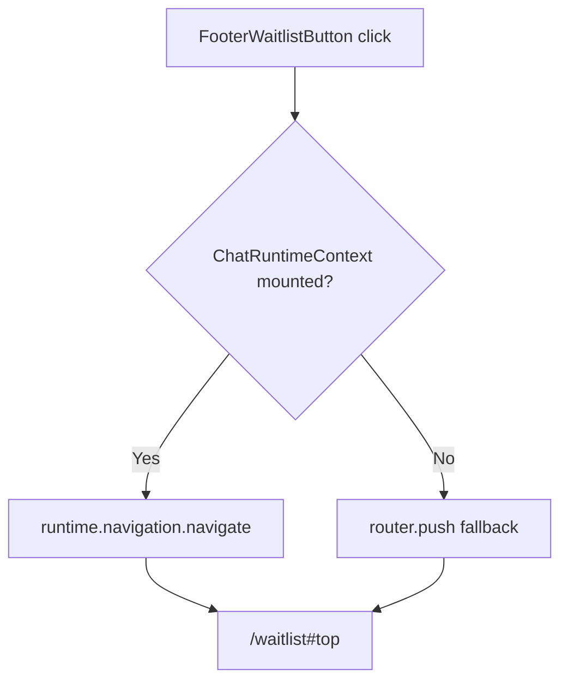

<!-- source-hash: 4d908f9cf7af91751965e17795b7dff2 -->
A footer button component that navigates users to the OpenFrame waitlist page, routing through the host's unified navigation system when available.

## Key Components

**`FooterWaitlistButtonProps`**
- `className?: string` — optional CSS class forwarded to the underlying `Button`

**`FooterWaitlistButton`**
- Resolves navigation via `executeNavigationImperative`, preferring `runtime.navigation.navigate` (unified nav) over the embed-shim's `router.push` fallback
- Target: `/waitlist#top` — uses an explicit `id="top"` anchor for reliable cross-browser scroll behavior
- Renders an `OpenFrameLogo` icon alongside the "Join Waitlist" label

## Navigation Priority



## Usage Example

```typescript
// Basic usage inside a footer layout
import { FooterWaitlistButton } from './footer-waitlist-button';

export function SiteFooter() {
  return (
    <footer>
      <FooterWaitlistButton className="mt-4 w-full" />
    </footer>
  );
}
```

> **Note:** The component works without a `ChatRuntimeContext` provider — third-party embedders get the embed-shim router fallback automatically. When `ChatRuntimeContext` is mounted (e.g., inside the Hub's `HubRuntimeProvider`), it inherits cross-platform new-tab decisions, same-URL re-scroll handling, and embed-mode short-circuiting at no extra cost.