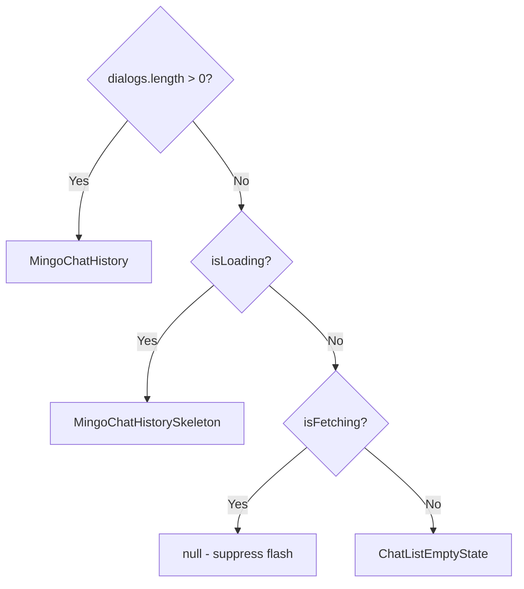

<!-- source-hash: c499bb92cb1ddfd48e76787dd129e08f -->
Renders the Chat Archive page UI, displaying date-grouped archived dialogs with conditional loading states, and supports both a standalone mode (with its own back/close header) and an embedded mode (headerless, for split layouts).

## Key Components

### `ChatArchivePage`
Main exported component that orchestrates the archive view. Conditionally renders:
- **Mobile header** (`ChatPanelHeaderMobile`) — back + close controls on small screens
- **Desktop header** — fixed-height bar with `ChatHeaderIconButton` cells for back/close
- **`MingoChatHistory`** — date-grouped dialog list when dialogs exist
- **`MingoChatHistorySkeleton`** — grouped placeholder during first-load
- **`ChatListEmptyState`** — archive-specific empty state with `BoxArchiveIcon`

### Props Interfaces

| Interface | Description |
|---|---|
| `ChatArchivePageStandaloneProps` | Requires `onBack` and `onClose`; renders its own header |
| `ChatArchivePageEmbeddedProps` | Sets `embedded: true`; omits header and forbids `onBack`/`onClose` |
| `ChatArchivePageBaseProps` | Shared: `dialogs`, `onSelectDialog`, `isLoading`, `isFetching`, `hasMore`, `onLoadMore` |

## Usage Example

```typescript
// Standalone mode (default)
<ChatArchivePage
  dialogs={archivedDialogs}
  onSelectDialog={(id) => openDialog(id)}
  onBack={() => setView('list')}
  onClose={() => setPanelOpen(false)}
  isLoading={isLoadingArchive}
  isFetching={isFetchingArchive}
  hasMore={hasNextPage}
  onLoadMore={fetchNextPage}
/>

// Embedded mode (split layout — host provides header)
<ChatArchivePage
  embedded
  dialogs={archivedDialogs}
  onSelectDialog={(id) => openDialog(id)}
  isLoading={isLoadingArchive}
/>
```

## Loading State Precedence

