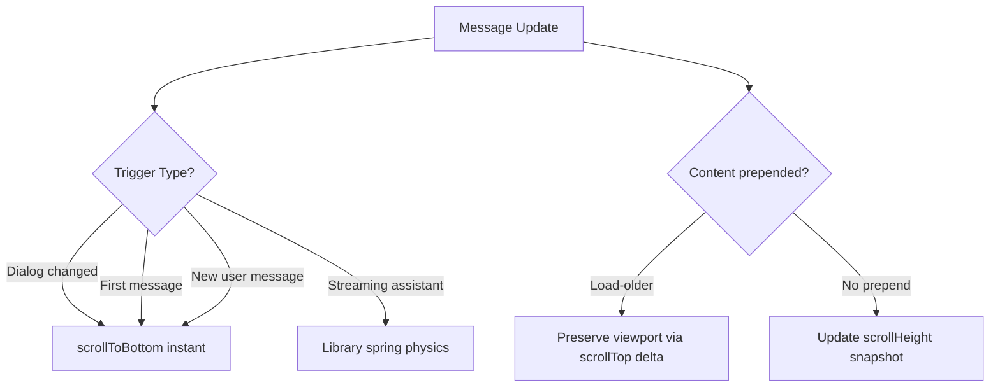

<!-- source-hash: ddaad2500e41f9ee61eff7435b990d72 -->
A scrollable chat message list component with stick-to-bottom behavior, prepend anchoring for load-older pagination, and streaming indicators.

## Key Components

| Export | Type | Description |
|--------|------|-------------|
| `ChatMessageList` | `forwardRef` Component | Main scrollable message list with auto-scroll management |
| `STREAMING_WORDS` | `const` | Flamingo-themed cycling phrases shown during AI streaming |
| `hasNonEmptyContent` | Helper Function | Checks if a `MessageContent` value carries visible text |
| `disposeAnchorWatcher` | Helper Function | Idempotent teardown for `AnchorWatcher` instances |
| `AnchorWatcher` | Interface | Tracks `ResizeObserver` + timeout for top-anchor settle window |

## Key Props (`ChatMessageListProps`)

| Prop | Description |
|------|-------------|
| `messages` | Array of chat messages to render |
| `dialogId` | Triggers instant scroll-to-bottom on dialog change |
| `isLoading` / `isTyping` | Controls skeleton and streaming indicator visibility |
| `autoScroll` | Enables/disables stick-to-bottom behavior |
| `hasNextPage` / `onLoadMore` | Infinite scroll upward (load-older pagination) |
| `renderEntityCard` | Custom renderer for entity card messages |

## Usage Example

```typescript
import { ChatMessageList } from "@/components/chat"

const messages = [
  { id: "1", role: "user", content: "Hello!" },
  { id: "2", role: "assistant", content: "Hi there!" },
]

export function ChatPanel() {
  const listRef = useRef<HTMLDivElement>(null)

  return (
    <ChatMessageList
      ref={listRef}
      messages={messages}
      dialogId="conv-abc123"
      isTyping={false}
      autoScroll={true}
      showAvatars={true}
      hasNextPage={true}
      onLoadMore={() => fetchOlderMessages()}
    />
  )
}
```

## Scroll Management Strategy

The component uses [`use-stick-to-bottom`](https://github.com/stackblitz-labs/use-stick-to-bottom) (same library powering bolt.new) with three additional behaviors layered on top:

