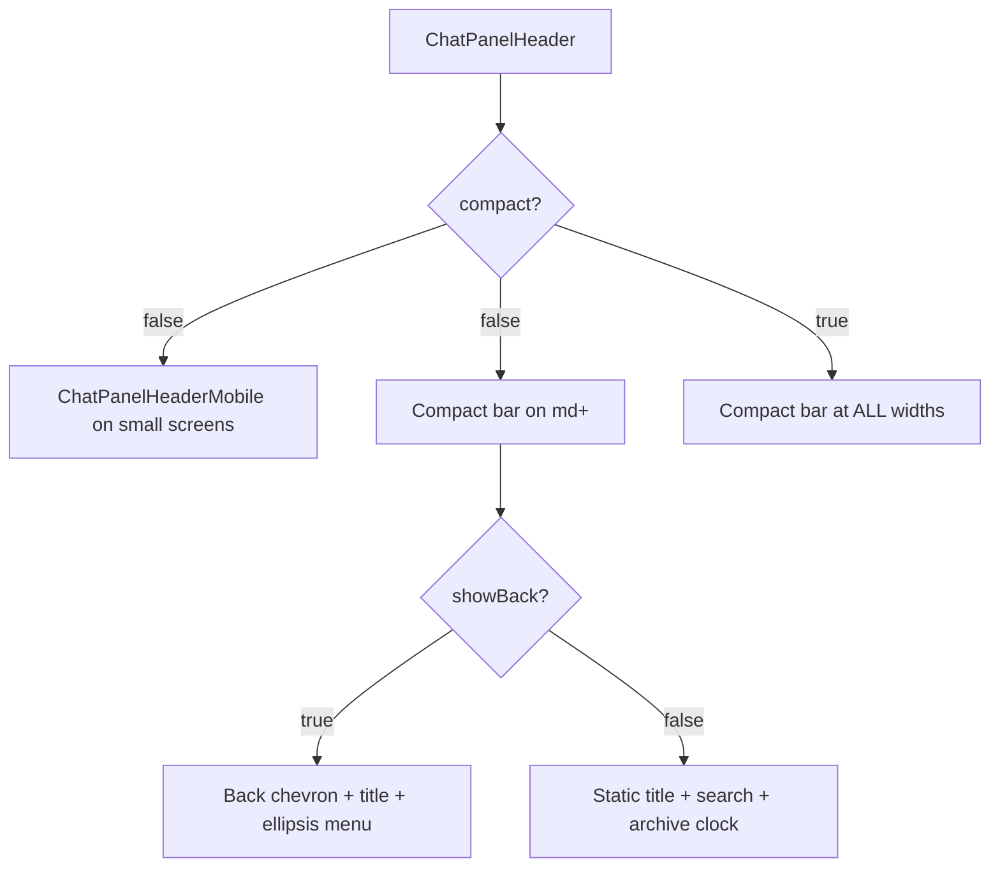

<!-- source-hash: 06fbb4632d6895d92e482f4903daf830 -->
Responsive top-navigation bar for the chat panel, rendering the correct header layout across list, active-conversation, archived-conversation, and compose views — with adaptive mobile/desktop breakpoints and inline search support.

## Key Components

| Export | Type | Description |
|---|---|---|
| `ChatPanelHeader` | Component | Main header bar with back navigation, title, avatar, action buttons, and close |
| `ChatPanelHeaderProps` | Interface | Full prop surface controlling layout, actions, search, and avatar |

## Usage Example

```typescript
// List view (no back, with search + archive entry)
<ChatPanelHeader
  title="My Chats"
  onClose={handleClose}
  onOpenArchive={handleOpenArchive}
  onToggleSearch={handleToggleSearch}
  searchActive={isSearchOpen}
  onSearchChange={handleSearchChange}
  searchQuery={currentQuery}
/>

// Active conversation view
<ChatPanelHeader
  showBack
  title="Support Thread"
  subtitle="Jane Smith"
  avatar={{ name: "Jane Smith", avatarUrl: "/avatars/jane.png" }}
  onBack={handleBack}
  onClose={handleClose}
  onRename={handleRename}
  onArchive={handleArchive}
/>

// Archived conversation (read-only)
<ChatPanelHeader
  showBack
  title="Old Thread"
  isArchivedView
  onBack={handleBack}
  onClose={handleClose}
  onRestore={handleRestore}
/>

// Embedded/compact mode (skips mobile full-screen layout)
<ChatPanelHeader
  title="Preview"
  compact
  onClose={handleClose}
/>
```

## Layout Behavior



**Right-hand action slots (desktop bar):**

| Condition | Rendered control |
|---|---|
| `isArchivedView && onRestore` | Refresh/unarchive button |
| `showBack && !isArchivedView` | ⋯ dropdown (rename / archive) |
| `!showBack && onToggleSearch` | Search toggle (hidden when inline search open) |
| `!showBack && onOpenArchive` | Clock/archive entry button |
| Always | × close button |

## Source

[`chat-panel-header.tsx`](https://github.com/flamingo-stack/openframe-oss-lib/blob/main/chat-panel-header.tsx)