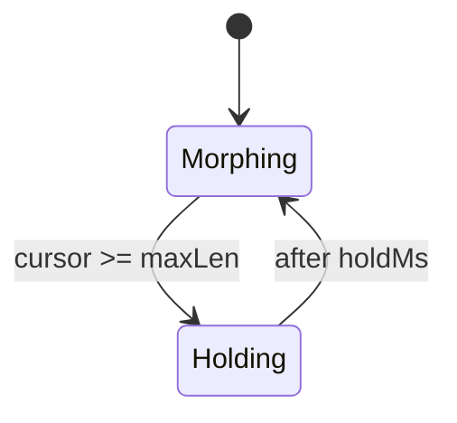

<!-- source-hash: 9194bff6a46e5277230795354c61e35e -->
A React component that renders a terminal-style cycling text animation, morphing through a list of words character-by-character with a blinking block cursor.

## Key Components

### `CyclingPhrase`
The default export. Cycles through `words` indefinitely using a left-to-right character overwrite morph — each character position transitions from the current word to the next, then holds before advancing.

### `CyclingPhraseProps`

| Prop | Type | Default | Description |
|------|------|---------|-------------|
| `words` | `readonly string[]` | — | Words to cycle through |
| `className` | `string` | — | Applied to outer `<span>` |
| `charMs` | `number` | `60` | Milliseconds per character during morph |
| `holdMs` | `number` | `4500` | Milliseconds to hold fully-typed word |

### State Machine



## Usage Example

```typescript
import { CyclingPhrase } from "./cycling-phrase"

export function StatusBanner() {
  return (
    <p>
      Mingo is{" "}
      <CyclingPhrase
        words={["Thinking", "Analyzing", "Vibing"]}
        charMs={60}
        holdMs={3000}
        className="font-mono text-yellow-400"
      />
    </p>
  )
}
```

## Notes

- **Layout stable**: width is pinned to the longest word using an invisible placeholder `<span>`, preventing layout shift as words change length.
- **Accessible**: visible text uses `aria-live="polite"`; the cursor block and placeholder are `aria-hidden`.
- **Style injection**: `BLINK_KEYFRAMES` is injected via `dangerouslySetInnerHTML` once per render tree — safe for multiple instances since CSS `@keyframes` rules are idempotent.
- A static `...` suffix always follows the word.