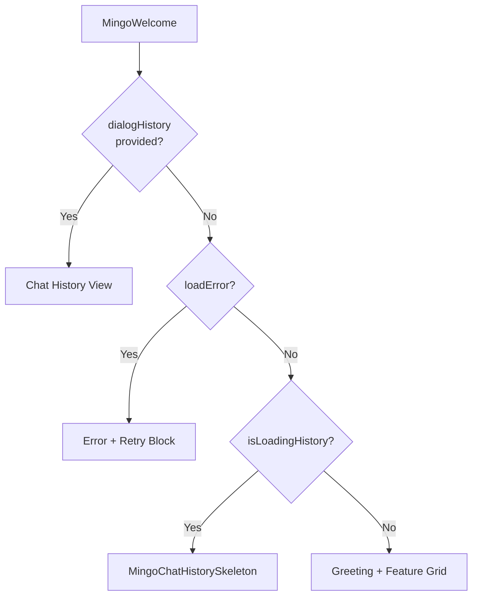

<!-- source-hash: 4b7cfd6d117eeb1fd557cdd7ff13a47a -->
Renders the Mingo AI chat empty state, including a personalized greeting, capability feature grid, optional one-time onboarding promo notification, and quick-action chips — with distinct states for new users, returning users (chat history), loading, and load errors.

## Key Components

### Interfaces

| Export | Description |
|--------|-------------|
| `MingoFeatureCard` | Single cell in the 2-up capability grid (icon + text) |
| `MingoWelcomePromo` | "New to OpenFrame?" one-time notification config |
| `MingoQuickAction` | Extra quick-action chip appended after "Start Guide Chat" |
| `MingoWelcomeProps` | Full props surface for `MingoWelcome` |

### Component

**`MingoWelcome`** — Main export. Figma node `7532:222444`.

Renders one of four states depending on props:



### Internal Behaviors
- **Promo dismissal** — persisted to `localStorage` or `sessionStorage` (SSR-safe, storage-error-tolerant)
- **Scroll fade affordances** — top/bottom gradient via `ResizeObserver` on the scroll container
- **Heading resolution** — `title` prop → `"Hey {userName}, I'm Mingo"` → `"Hey, I'm Mingo"`

## Usage Example

```typescript
import { MingoWelcome } from './mingo-welcome'

// New user — show greeting, feature grid, and Guide Chat promo
<MingoWelcome
  userName="Alex"
  onStartGuideChat={() => switchToGuideMode()}
/>

// Returning user — replace greeting with chat history
<MingoWelcome
  userName="Alex"
  hasExistingChats
  dialogHistory={<MingoChatHistory dialogs={dialogs} />}
  isLoadingHistory={isLoading}
  loadError={hasFailed}
  onRetry={refetch}
  onStartGuideChat={() => switchToGuideMode()}
  quickActions={[
    { id: 'explore', label: 'Explore', icon: <CompassIcon />, onClick: openExplorer },
  ]}
/>

// Custom branding — suppress OpenFrame defaults
<MingoWelcome
  title="Hey, I'm your AI assistant"
  subtitle="Ask me anything."
  featureCards={myCards}
  promo={null}
/>
```