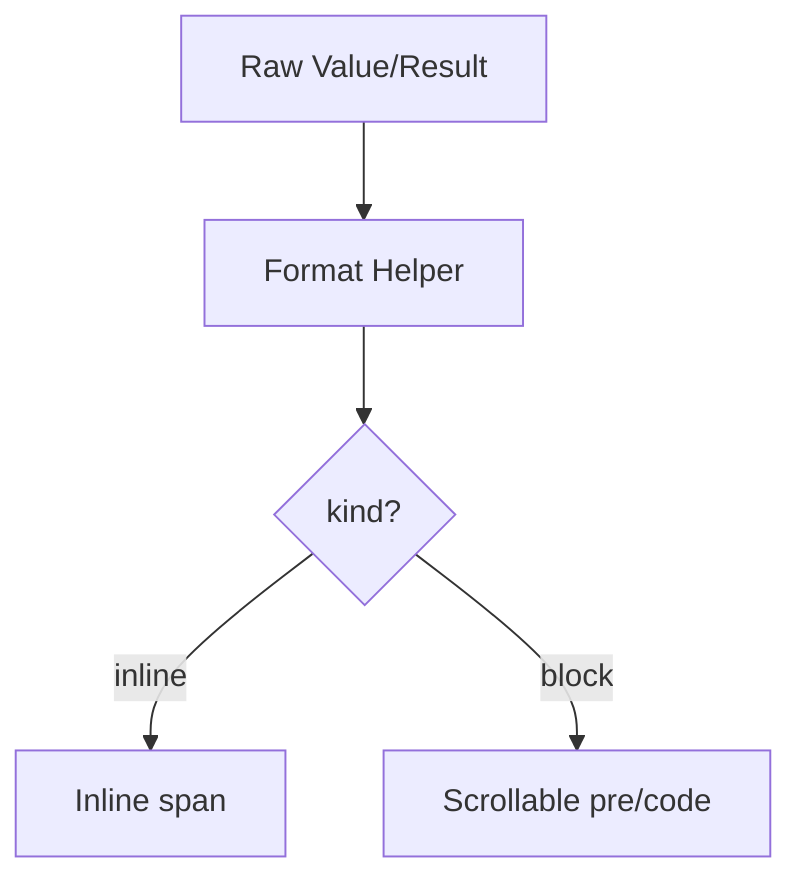

<!-- source-hash: c2806ae4c954c7e6f9d20b3fe6ddb5f6 -->
Reusable React components for rendering tool call arguments and results in the Flamingo/OpenFrame AI chat interface, handling both inline and block display formats.

## Key Components

### `ArgRow`
Renders a single tool argument as either an inline `key: value` pair (for short values) or a labeled scrollable `<pre>` block (for long JSON, scripts, or multiline content). Shared across `ApprovalBatchMessage` and `ToolExecutionDisplay` for consistent rendering.

| Prop | Type | Description |
|------|------|-------------|
| `argKey` | `string` | The argument name/key |
| `value` | `unknown` | The argument value (any type) |

### `ResultBlock`
Renders a tool execution result as either inline text or a scrollable code block, depending on length and content type. Returns `null` when result is empty.

| Prop | Type | Description |
|------|------|-------------|
| `result` | `string \| undefined \| null` | The tool execution output |
| `className` | `string?` | Optional additional CSS classes |

## Usage Example

```typescript
import { ArgRow, ResultBlock } from "./tool-call-blocks"

// Rendering tool arguments
<ArgRow argKey="script" value={`console.log("hello")`} />
<ArgRow argKey="timeout" value={30} />

// Rendering tool result
<ResultBlock result={toolOutput} className="mt-2" />
```

## Display Logic

Both components delegate format decisions to `formatToolArgValue` and `formatToolResult` helpers, which return a `kind` of `"inline"` or `"block"`:

