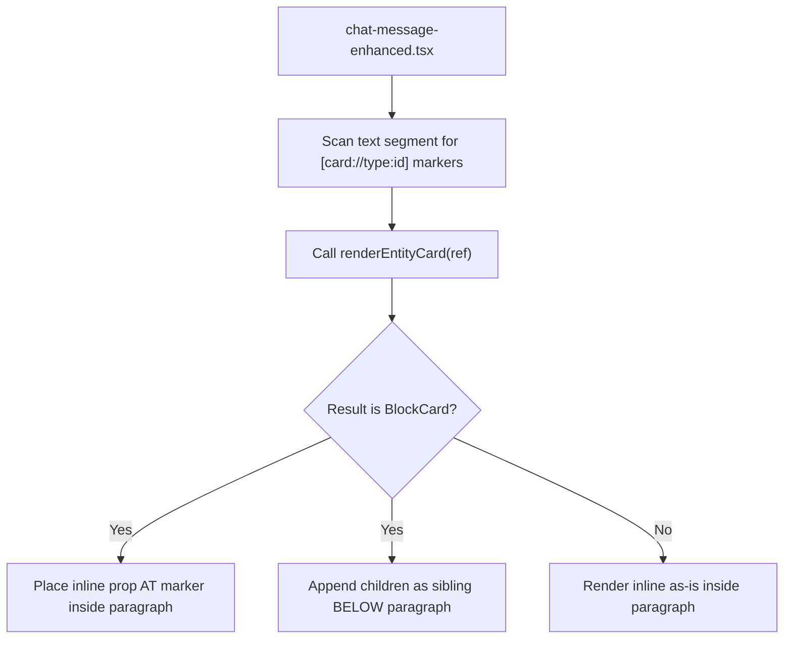

<!-- source-hash: c4f460ddb603f582424bec5b5d1e9d76 -->
Sentinel component used by `renderEntityCard` to signal that a card's content is block-level HTML (e.g. `<div>`, `<EntityVideoSection>`) and cannot legally render inside a markdown `<p>` tag.

## Key Components

### `BlockCard`
A no-op sentinel function component — it always returns `null`. Its purpose is **not** to render, but to be detected by type identity during the pre-scan in `chat-message-enhanced.tsx`, which splits its props into two placement zones.

### `BlockCardProps`
| Prop | Type | Description |
|------|------|-------------|
| `inline` | `React.ReactNode` (optional) | Compact UI placed **at** the marker position inside the `<p>` (e.g. a 56×56 thumbnail card). Falls back to a plain `<span>` with the ref title if omitted. |
| `children` | `React.ReactNode` | Block-level content appended as a **sibling below** the paragraph, where it is HTML-valid. |

## How the Pre-Scan Works



## Usage Example

```typescript
// Inside renderEntityCard — return a BlockCard when the card
// contains block-level elements that can't nest in <p>
import { BlockCard } from './block-card'

function renderEntityCard(ref: EntityRef) {
  if (ref.type === 'video') {
    return (
      <BlockCard
        inline={<CompactVideoThumbnail ref={ref} />}  // placed inside <p>
      >
        <EntityVideoSection ref={ref} />              // hoisted below <p>
      </BlockCard>
    )
  }
}
```

> **Note:** `BlockCard` is a protocol tag, not a UI wrapper. Never render it directly outside of the `chat-message-enhanced` pipeline — if one escapes that path, the defensive `return null` prevents a crash.