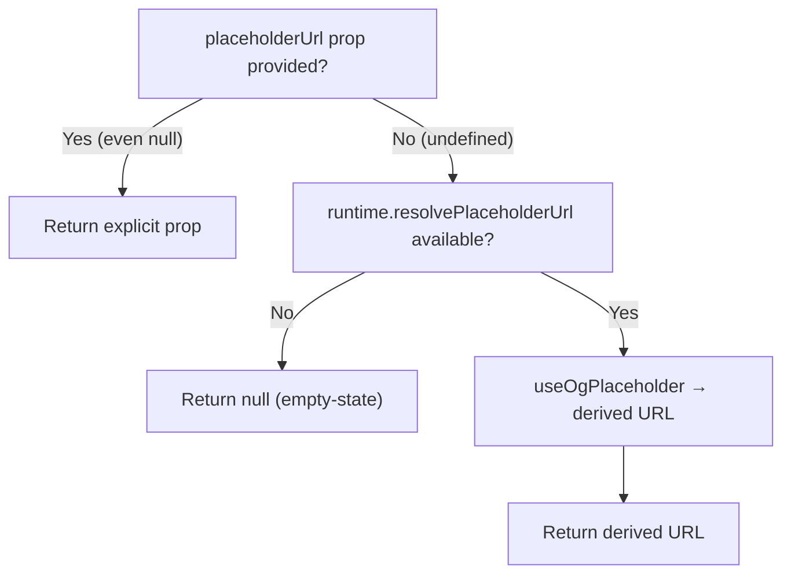

<!-- source-hash: 47ff9647270510c7af9d156b173b78dd -->
Resolves OG placeholder URLs for entity cards, consolidating placeholder logic inside the card rather than requiring callers to pre-compute it.

## Key Components

### `UseEntityCardPlaceholderArgs`
Interface defining hook inputs:
- `title` — entity label used in the placeholder image
- `placeholderUrl` — explicit override; bypasses runtime resolution entirely
- `siteName` — optional subtitle shown under the title
- `aspect` — output ratio: `'wide'` (default, catalog cards) or `'square'` (compact chat-inline cards)

### `useEntityCardPlaceholder(args)`
Main hook that resolves a placeholder URL via the following priority chain:



## Usage Example

```typescript
// Inside an entity card component
const placeholderSrc = useEntityCardPlaceholder({
  title: 'Acme Corp Firewall Policy',
  siteName: 'Configurations',
  aspect: 'wide',
})

// Explicit override — runtime resolver is skipped entirely
const placeholderSrc = useEntityCardPlaceholder({
  title: 'Device Report',
  placeholderUrl: 'https://cdn.example.com/custom-thumb.png',
})

// Embedder without wired runtime → returns null → card shows empty-state
const placeholderSrc = useEntityCardPlaceholder({ title: 'Orphaned Card' })
// → null
```

## Notes

- **Backwards compatible** — passing an explicit `placeholderUrl` (including `null`) always wins, so existing callers (chat dispatch, tests) are unaffected
- Embedders that don't wire `ChatRuntime.resolvePlaceholderUrl` receive `null` and trigger the card's built-in empty-state fallback