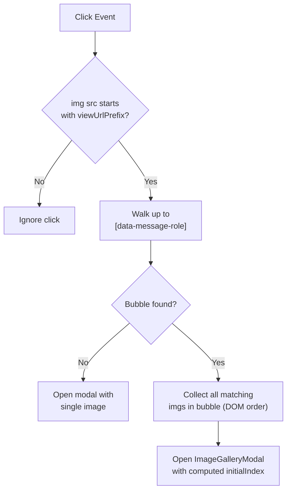

<!-- source-hash: 129697fa517b38437fd6fa76813ba652 -->
Provides a React hook that enables click-to-expand image gallery functionality for chat attachment images within a chat thread panel.

## Key Components

### `useChatAttachmentImageGallery()`
Primary export. Returns `{ panelRef, modal }`:
- **`panelRef`** — `RefObject<HTMLDivElement>` to attach to the chat content wrapper; installs a delegated `click` listener
- **`modal`** — JSX element (`ImageGalleryModal`) rendered when open, or `null` when closed (enabling React garbage collection of blob URLs)

### `GalleryState` (interface)
Internal state shape: `{ isOpen: boolean, images: string[], initialIndex: number }`

### `absolutize(prefix: string)` (internal)
Normalizes relative URL prefixes (e.g. `/api/storage/view/`) to absolute URLs for reliable comparison against browser-resolved `.src` values.

## Usage Example

```typescript
// In a chat panel host component
export function ChatPanel() {
  const { panelRef, modal } = useChatAttachmentImageGallery()

  return (
    <>
      {/* panelRef wraps the scrollable message list */}
      <div ref={panelRef} className="chat-thread-wrapper">
        {/* ...message bubbles rendered here... */}
      </div>

      {/* modal renders outside overflow-hidden bubbles */}
      {modal}
    </>
  )
}
```

## Click Delegation Flow



> **Note:** The hook filters `` elements by `attachmentViewUrlPrefix` from the chat runtime context, ensuring avatar and UI images are never intercepted.