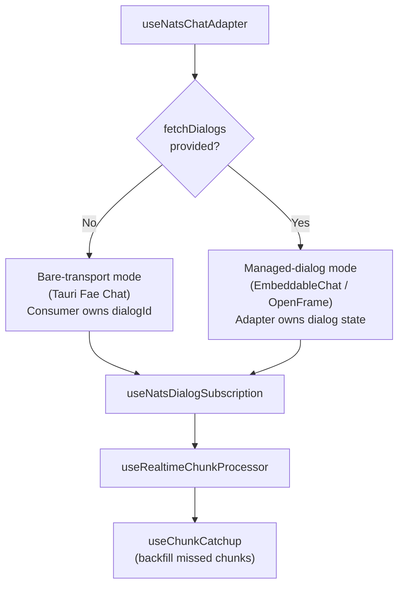

<!-- source-hash: b9d69cbad30b3255bb4a2e431b361bcd -->
Provides a NATS/WebSocket transport adapter for Flamingo's unified chat surface, implementing the `UnifiedChatState` contract for Mingo-mode streaming. It manages live NATS event subscriptions, real-time chunk processing, chunk catchup, and optional dialog lifecycle (list, select, create, delete, archive) so the host `useChat({ mode })` dispatcher requires zero branching logic.

## Key Components

### Interfaces

| Interface | Purpose |
|-----------|---------|
| `UseNatsChatAdapterConfig` | Consumer-supplied configuration; only `getNatsWsUrl` + `publishUserMessage` are required |
| `FetchDialogsParams` / `FetchDialogsResult` | Paginated dialog list fetch contract |
| `FetchDialogMessagesParams` / `FetchDialogMessagesResult` | Paginated message history fetch contract |

### Operating Modes



### Key Config Fields

| Field | Required | Description |
|-------|----------|-------------|
| `getNatsWsUrl` | ✅ | Returns NATS WebSocket URL or `null` to pause subscription |
| `publishUserMessage` | ✅ | Consumer-owned send; adapter only updates local state + calls this |
| `topics` | ❌ | NATS subjects to tail; use `['admin-message']` for Mingo/admin chat |
| `fetchDialogs` | ❌ | Enables managed-dialog mode with sidebar pagination |
| `fetchDialogMessages` | ❌ | Loads history on dialog switch |
| `createDialog` / `deleteDialog` | ❌ | Dialog lifecycle; omitting hides affordances |
| `approveRequest` / `rejectRequest` | ❌ | Tool-call approval cards; omitting disables buttons |
| `stopGeneration` | ❌ | Backend cancellation; omitting makes stop UI-only |

## Usage Example

```typescript
// Bare-transport mode (Tauri Fae Chat / v0 consumers)
const chatState = useNatsChatAdapter({
  dialogId: 'dialog-abc123',
  getNatsWsUrl: () => 'wss://nats.example.com',
  publishUserMessage: async (text, { dialogId }) => {
    await fetch('/api/chat/send', {
      method: 'POST',
      body: JSON.stringify({ text, dialogId }),
    })
  },
  topics: ['admin-message'], // Required for Mingo/admin agent replies
})

// Managed-dialog mode (OpenFrame EmbeddableChat)
const chatState = useNatsChatAdapter({
  getNatsWsUrl: () => wsUrl,
  publishUserMessage: sendToBackend,
  topics: ['admin-message'],
  fetchDialogs: async ({ cursor, limit }) =>
    api.getDialogs({ cursor, limit }),
  fetchDialogMessages: async ({ dialogId, cursor }) =>
    api.getMessages({ dialogId, cursor }),
  createDialog: async () => api.newDialog(),
  deleteDialog: async (id) => api.deleteDialog(id),
  approveRequest: async (requestId) => api.approve(requestId),
  stopGeneration: async (dialogId) => api.cancelStream(dialogId),
})
```

> **Note:** Always set `topics: ['admin-message']` for Mingo/admin deployments. Using the default `['message']` topic will cause assistant responses to never arrive, leaving the UI in the `thinking` phase indefinitely.