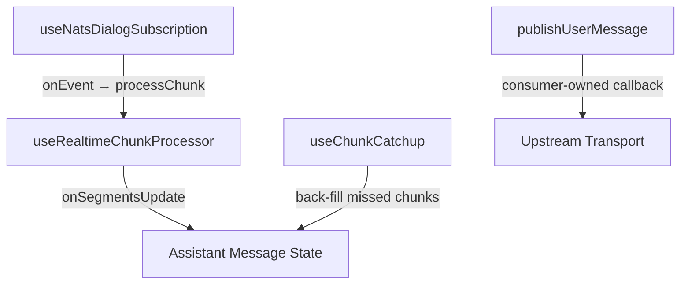

<!-- source-hash: b9d69cbad30b3255bb4a2e431b361bcd -->
Realtime NATS/WebSocket transport adapter that bridges the Mingo AI chat surface to the unified `UnifiedChatState` contract, supporting both bare-transport and managed-dialog operating modes.

## Key Components

### Config Types

| Type | Purpose |
|------|---------|
| `UseNatsChatAdapterConfig` | Main consumer configuration — wires up NATS URL, message publish, dialog management callbacks, and feature flags |
| `FetchDialogsParams` / `FetchDialogsResult` | Paginated dialog list fetching (cursor-based) |
| `FetchDialogMessagesParams` / `FetchDialogMessagesResult` | Paginated message history fetching with optional token usage |

### Composition Stack



### Operating Modes

| Mode | Trigger | Behavior |
|------|---------|---------|
| **Bare-transport** | `config.dialogId` provided | Consumer owns dialog lifecycle; adapter does no list/select bookkeeping |
| **Managed-dialog** | `fetchDialogs` provided | Adapter owns active dialog id, list, pagination, history merge |

### Optional Feature Flags

- `topics` — NATS subjects to subscribe to (default: `['message']`; use `['admin-message']` for Mingo/admin chat)
- `enableThinking` — surfaces `THINKING` chunks as segments
- `batchApprovalsEnabled` — single batch approval card vs. legacy per-tool cards

## Usage Example

```typescript
const chatState = useNatsChatAdapter({
  // Bare-transport mode (Tauri Fae Chat)
  dialogId: activeDialogId,
  getNatsWsUrl: () => `wss://nats.example.com`,
  publishUserMessage: async (text, { dialogId }) => {
    await fetch('/api/chat/send', {
      method: 'POST',
      body: JSON.stringify({ text, dialogId }),
    })
  },
  topics: ['admin-message'], // Required for Mingo/admin chat
  batchApprovalsEnabled: true,
})

// Managed-dialog mode (EmbeddableChat sidebar)
const chatState = useNatsChatAdapter({
  getNatsWsUrl: () => `wss://nats.example.com`,
  publishUserMessage: async (text, { dialogId }) => { /* ... */ },
  fetchDialogs: async ({ cursor, limit }) => myApi.listDialogs({ cursor, limit }),
  fetchDialogMessages: async ({ dialogId, cursor }) =>
    myApi.getMessages({ dialogId, cursor }),
  createDialog: async () => myApi.newDialog(),
  deleteDialog: async (id) => myApi.deleteDialog(id),
  approveRequest: async (requestId) => myApi.approve(requestId),
  stopGeneration: async (dialogId) => myApi.cancel(dialogId),
})
```

> **Note:** Always set `topics: ['admin-message']` when integrating with Mingo/OpenFrame admin chat. Using the default `'message'` topic will cause the subscription to tail the wrong NATS subject, leaving the assistant stuck in the `thinking` phase indefinitely.