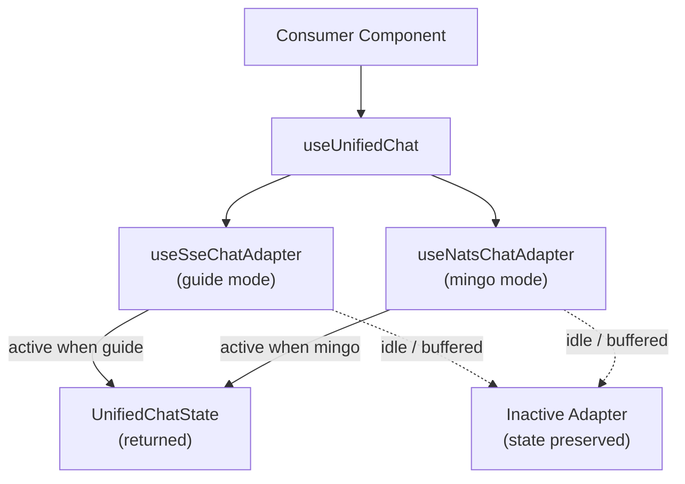

<!-- source-hash: 5f44f9c9a190ae929c177b9308e2bf01 -->
Single public entry-point hook that dispatches chat state and actions to either the SSE/Guide or NATS/Mingo transport adapter based on the active mode, while always satisfying React's rules of hooks by keeping both adapters mounted.

## Key Components

| Export | Type | Description |
|--------|------|-------------|
| `useUnifiedChat` | Hook | Primary hook — returns a stable `UnifiedChatState` for the active transport |
| `ChatMode` | Type | `'guide'` (SSE) or `'mingo'` (NATS) |
| `UseUnifiedChatModes` | Interface | Per-mode config slots; each is optional |
| `UseUnifiedChatOptions` | Interface | `{ modes, activeMode }` passed to the hook |

## Architecture



## Usage Example

```typescript
// Guide-only consumer
const chat = useUnifiedChat({
  activeMode: 'guide',
  modes: {
    guide: { /* UseSseChatAdapterOptions */ },
  },
})

// Dual-mode consumer (mode toggle lives in the shell component)
const chat = useUnifiedChat({
  activeMode: currentMode, // 'guide' | 'mingo'
  modes: {
    guide: {},
    mingo: {
      dialogId: 'dialog-abc',
      getNatsWsUrl: () => 'wss://nats.example.com',
      publishUserMessage: async (msg) => publishToNats(msg),
    },
  },
})

chat.sendMessage('How do I reset a password?')
```

## Key Behaviours

- **Both adapters always mount** — inactive adapter holds its message buffer, so flipping `activeMode` restores the user to exactly where they left off in each conversation.
- **Disabled fallback** — if a mode's config slot is `undefined`, a stable no-op default is injected (ref-stabilised for NATS, constant for SSE) to prevent hook churn.
- **Stable return identity** — all callbacks are `useCallback`-wrapped and the final object is `useMemo`-stabilised; consumers receive a referentially stable `UnifiedChatState` on every render.