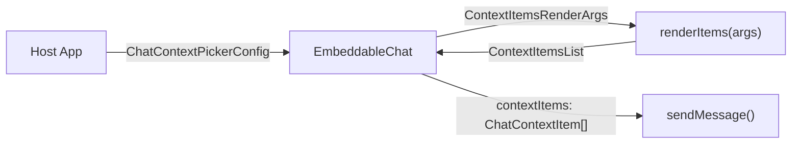

<!-- source-hash: 2c3df3f602c538f0cb46b662593cc722 -->
Defines TypeScript interfaces for the chat composer's entity-context picker system, establishing the contract between the library's picker UI and the host application's data layer.

## Key Components

| Export | Kind | Purpose |
|---|---|---|
| `ChatContextEntityType` | Interface | Represents a selectable entity type (Device, Script, Ticket) shown in the picker's first-level list |
| `ChatContextItem` | Interface | A concrete selected context item (one device, one script) with stable backend ID and display metadata |
| `ContextItemsRenderArgs` | Interface | Arguments passed to `renderItems` for the active entity type, including query state and selection callbacks |
| `ChatContextPickerConfig` | Interface | Host-provided configuration that activates the full picker UI — entity types, render delegate, selection cap, and optional file upload |

## Architecture

The library owns the **picker shell** (dropdown chrome, entity-type list, search field, Suspense/skeleton/error boundary); the host owns **data** via `renderItems`. The host wires config into `<EmbeddableChat contextPicker={…}>` and receives selections back through `sendMessage(text, { contextItems })`.



## Usage Example

```typescript
const contextPicker: ChatContextPickerConfig = {
  entityTypes: [
    { type: 'DEVICE', label: 'Device', marker: 'device', icon: <DeviceIcon /> },
    { type: 'SCRIPT', label: 'Script', marker: 'kb', icon: <ScriptIcon /> },
  ],
  maxItems: 5,
  renderItems: ({ type, query, selectedKeys, onToggle, atLimit }) => (
    <DeviceItemsList
      query={query}
      selectedKeys={selectedKeys}
      onToggle={onToggle}
      atLimit={atLimit}
    />
  ),
  onUploadFile: () => openFilePicker(),
}

// Wire into the composer
<EmbeddableChat contextPicker={contextPicker} />

// Received on send
sendMessage(text, {
  contextItems: [{ type: 'DEVICE', id: 'elk-prod-07', label: 'ELK-PROD-07' }]
})
```

## Notes

- `ChatContextEntityType.marker` maps to the backend's `@marker:id` mention vocabulary; falls back to lowercased `type` when omitted
- `ContextItemsRenderArgs.selectedKeys` uses a composite `"${type}:${id}"` key format
- Host render components may **suspend** — the picker wraps `renderItems` in `<Suspense>` with a skeleton fallback plus an error boundary
- The picker is **inert** unless `contextPicker` is supplied to `<EmbeddableChat>`

**Source:** [`context-item.types.ts`](https://github.com/flamingo-stack/openframe-oss-lib/blob/main/context-item.types.ts)