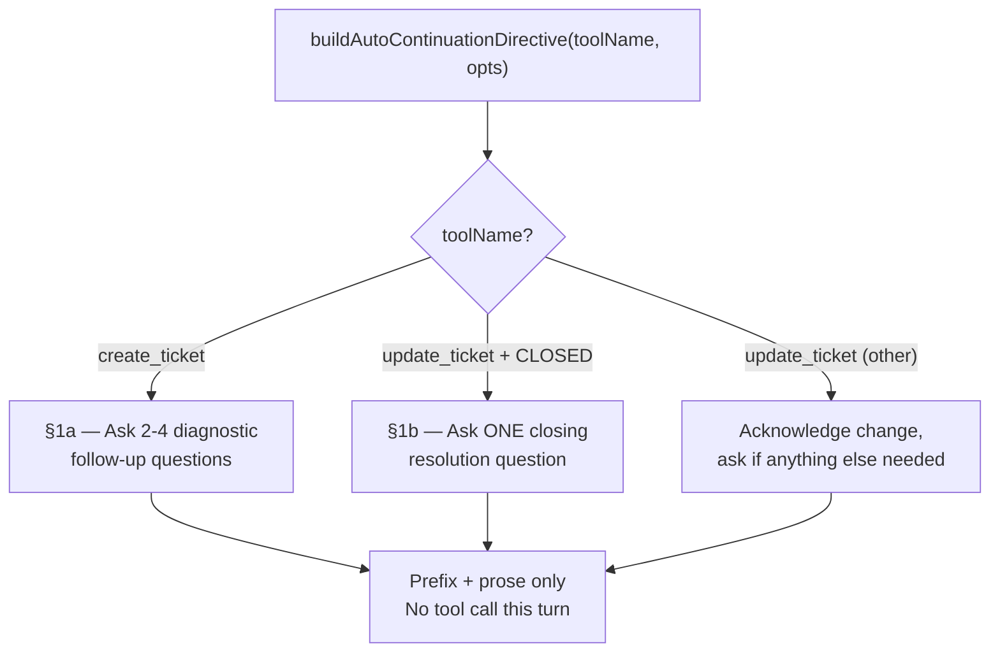

<!-- source-hash: 202df1de78269679793058f2735da78c -->
Brief description of the file's purpose and what it does.

Defines the shared cross-process contract for the post-approval auto-continuation directive, providing a single source of truth for both server-side routing and client-side message construction.

## Key Components

| Export | Type | Description |
|--------|------|-------------|
| `AUTO_CONTINUATION_DIRECTIVE_PREFIX` | `const string` | Sentinel prefix used by both `decideRoute` (server) and `autoContinueRef` (client) to identify hidden directive messages |
| `BuildAutoContinuationOptions` | `interface` | Options bag for `ticketId` and `status` to branch directive logic |
| `buildAutoContinuationDirective` | `function` | Builds the hidden synthetic user message injected after every successful tool approval |

## Directive Branches



## Usage Example

```typescript
import {
  AUTO_CONTINUATION_DIRECTIVE_PREFIX,
  buildAutoContinuationDirective,
} from './auto-continuation-directive'

// After a create_ticket approval — injects diagnostic follow-up Qs
const directive = buildAutoContinuationDirective('create_ticket', {
  ticketId: '4821',
})
// → "[internal-auto-continuation] The user just approved create_ticket (ticket #4821). ..."

// After closing a ticket
const closeDirective = buildAutoContinuationDirective('update_ticket', {
  ticketId: '4821',
  status: 'CLOSED',
})
// → "[internal-auto-continuation] The user just approved closing ticket #4821. ..."

// Server-side route guard — tools disabled for directive turns
if (rawUserQuery.startsWith(AUTO_CONTINUATION_DIRECTIVE_PREFIX)) {
  disableTools()
}
```

## Important Constraints

- **Never drift the prefix** — server `decideRoute` and client `autoContinueRef` must both import from this file. A mismatched literal silently re-enables tools, causing the LLM to duplicate the just-approved tool call.
- **Tools are hard-disabled** on the directive turn — all branches instruct the LLM to respond with prose only.
- `toolName` is typed as `string` (not a const-union) intentionally, keeping the module generic across hub deployments.