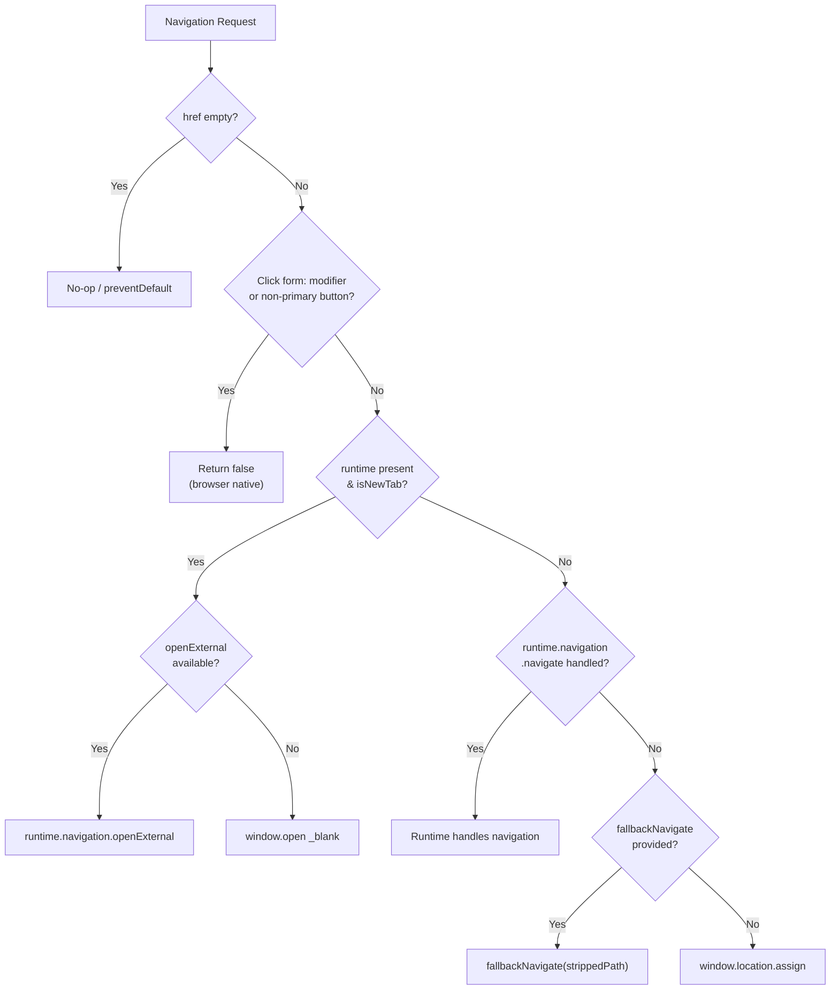

<!-- source-hash: 372bccd2d9bf52ce138aef0ee5708d07 -->
Unified navigation execution primitive that encodes all navigation decisions — new-tab vs. same-tab, internal vs. external, embed vs. host, and runtime/router/window fallback chain — into a single execution point for the entire library.

## Key Components

### Interfaces

- **`NavClickEvent`** — Minimal structural mouse-event surface, allowing chip buttons and tiles to call navigation without casting `React.MouseEvent`
- **`ExecuteNavigationClickArgs`** — Arguments for click-handler form, including event, runtime, href, path, targetPlatform, and optional router fallback
- **`ExecuteNavigationImperativeArgs`** — Streamlined arguments for programmatic navigation (no event handling)

### Functions

- **`runNavigation`** *(internal)* — Core decision engine: resolves `computeIsNewTab`, dispatches to `runtime.navigation.openExternal`, `runtime.navigation.navigate`, `fallbackNavigate`, or `window.location.assign` in priority order
- **`executeNavigation`** — Click-handler form; guards against modifier keys and non-primary buttons, returns `true` if it consumed the event
- **`executeNavigationImperative`** — Programmatic form for buttons, list rows, and post-action redirects; same decision tree without event/modifier logic

## Usage Example

```typescript
// Click-handler form (anchor / chip / markdown link)
import { executeNavigation } from './execute-navigation'

function handleClick(event: React.MouseEvent) {
  executeNavigation({
    event,
    runtime,           // ChatRuntime | null
    href: 'https://example.com/tickets/123',
    path: '/tickets/123',
    targetPlatform: 'web',
    fallbackNavigate: router.push,  // useRouter().push
  })
}

// Imperative form (button action / post-form redirect)
import { executeNavigationImperative } from './execute-navigation'

executeNavigationImperative({
  runtime,
  href: 'https://example.com/tickets/123',
  targetPlatform: 'web',
  fallbackNavigate: router.push,
})
```

## Decision Tree

