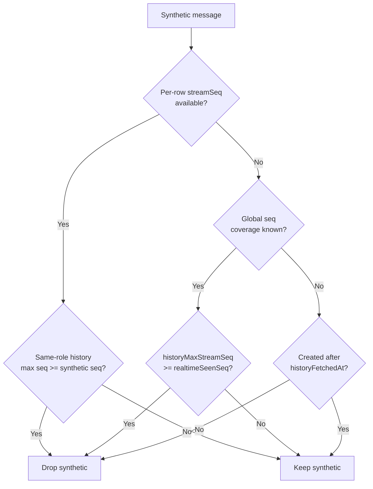

<!-- source-hash: 5df51000b55f2d031915f5b4412ac8e6 -->
Reconciles persisted dialog history (processed GraphQL pages) with realtime messages accumulated from streaming chunks, preventing both duplicate and lost turns across MSP chat interfaces (Mingo, tickets, openframe-chat).

## Key Components

### Interfaces & Types

- **`MergeableChatMessage`** — Minimal structural contract for mergeable messages; hosts pass their own type and get it back. Includes optional `streamSeq` for per-message coverage resolution.
- **`HistoryMergeInput<M>`** — Input shape for `mergeHistoryWithRealtime`, encapsulating processed history, existing realtime messages, seq signals, and fetch timestamps.

### Constants

- **`SYNTHETIC_REALTIME_ID_PREFIXES`** — Cross-host contract listing all client-minted ID prefixes (`assistant-`, `user-`, `direct-`, `system-`, `error-`). Centralised here to prevent double-rendering of persisted/synthetic message pairs.

### Functions

| Function | Description |
|---|---|
| `mergeHistoryWithRealtime<M>` | Core merge logic. Applies seq-based coverage, per-role max seq, approval batch reconciliation, and wall-clock fallback to produce a single deduplicated message list. |
| `flattenMessagePagesChronological<T>` | Flattens DESC-sorted GraphQL pages into a single chronological array. |
| `maxPersistedStreamSeq` | Computes the highest `lastChunkStreamSeq` across all history pages; used as the `historyMaxStreamSeq` input and JetStream replay offset. |
| `assistantAnswerText` | Extracts rendered text from an assistant message for content-based deduplication fallback. |

## Usage Example

```typescript
import {
  mergeHistoryWithRealtime,
  flattenMessagePagesChronological,
  maxPersistedStreamSeq,
} from '@openframe-oss-lib/history-merge'

const processedHistory = flattenMessagePagesChronological(queryData?.pages)
const historyMaxStreamSeq = maxPersistedStreamSeq(queryData?.pages)

const merged = mergeHistoryWithRealtime({
  processedHistory,
  existingMessages: store.messages,
  streamingMessageId: activeStreamId ?? null,
  historyFetchedAt: dataUpdatedAt,
  historyMaxStreamSeq,
  realtimeSeenStreamSeq: store.lastSeenSeq,
})

store.setMessages(merged)
```

## Coverage Resolution Priority



> **Source:** [`history-merge.ts`](https://github.com/flamingo-stack/openframe-oss-lib/blob/main/history-merge.ts)