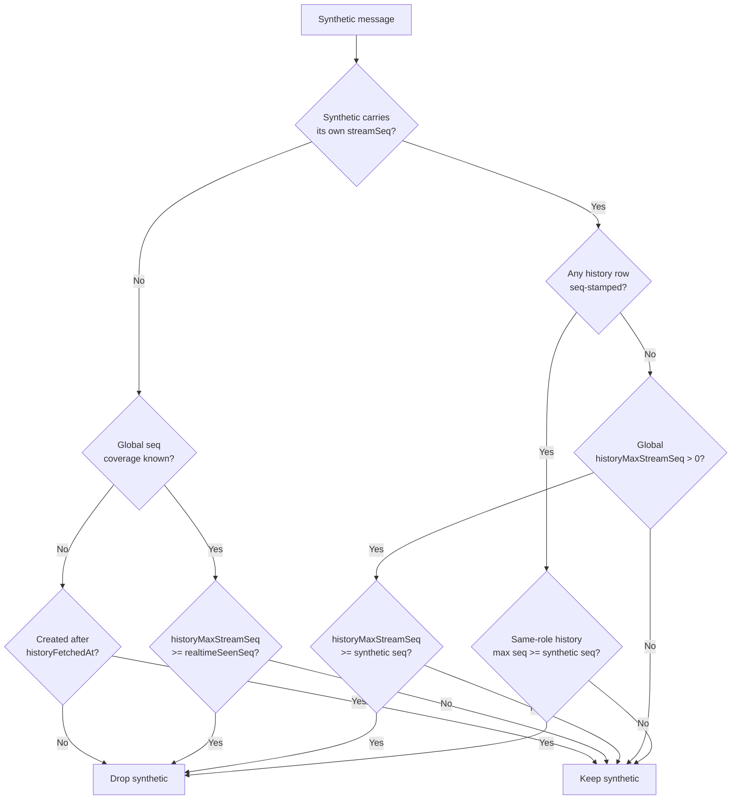

<!-- source-hash: f5c3c4354e937c99e37f2acc47057b09 -->
Reconciles persisted dialog history (processed GraphQL pages) with realtime messages accumulated from streaming chunks, preventing both duplicate and lost turns across MSP chat interfaces (Mingo, tickets, openframe-chat).

## Key Components

### Interfaces & Types

- **`MergeableChatMessage`** — Minimal structural contract for mergeable messages; hosts pass their own type and get it back. Includes optional `streamSeq` for per-message coverage resolution.
- **`HistoryMergeInput<M>`** — Input shape for `mergeHistoryWithRealtime`, encapsulating processed history, existing realtime messages, seq signals, and fetch timestamps.

### Constants

- **`SYNTHETIC_REALTIME_ID_PREFIXES`** — Cross-host contract listing all client-minted ID prefixes (`assistant-`, `user-`, `direct-`, `system-`, `error-`). Centralised here to prevent double-rendering of persisted/synthetic message pairs.

### Functions

| Function | Description |
|---|---|
| `mergeHistoryWithRealtime<M>` | Core merge logic. Applies seq-based coverage, per-role max seq, approval batch reconciliation, and wall-clock fallback to produce a single deduplicated message list. |
| `flattenMessagePagesChronological<T>` | Flattens DESC-sorted GraphQL pages into a single chronological array. |
| `maxPersistedStreamSeq` | Computes the highest `lastChunkStreamSeq` across all history pages; used as the `historyMaxStreamSeq` input and JetStream replay offset. |
| `assistantAnswerText` | Extracts rendered text from an assistant message for content-based deduplication fallback. |

## Usage Example

```typescript
import {
  mergeHistoryWithRealtime,
  flattenMessagePagesChronological,
  maxPersistedStreamSeq,
} from '@openframe-oss-lib/history-merge'

const processedHistory = flattenMessagePagesChronological(queryData?.pages)
const historyMaxStreamSeq = maxPersistedStreamSeq(queryData?.pages)

const merged = mergeHistoryWithRealtime({
  processedHistory,
  existingMessages: store.messages,
  streamingMessageId: activeStreamId ?? null,
  historyFetchedAt: dataUpdatedAt,
  historyMaxStreamSeq,
  realtimeSeenStreamSeq: store.lastSeenSeq,
})

store.setMessages(merged)
```

## Coverage Resolution Priority



**A seq'd synthetic never falls back to wall-clock.** When nothing in history is
seq-stamped, `historyMaxStreamSeq === 0` is not "unknown, guess by clock" — it is
evidence that no persisted row has reached any seq, so the snapshot cannot
contain this turn. That case is the mid-stream refetch (a reconnect after the
window loses focus): the only persisted row of a turn in flight is the user
`MESSAGE_REQUEST`, which the backend does not stamp. Judging live bubbles by
wall-clock there read them all as "older than the fetch instant, therefore
persisted" and dropped every one except the single `streamingMessageId`,
collapsing the thread to the user's prompt.

This is why the reducer stamps `streamSeq` on the rows it owns — a live bubble
with no seq at all still lands in the wall-clock branch.

## Turn identity (twins whose ids differ)

Keeping a live bubble is only half the job: history may hold its own PARTIAL
copy of the same in-flight turn, and then the turn renders twice with the two
copies disagreeing (a tool row `pending` in one, `failed` in the other) because
each stopped at a different chunk.

Ids do not help — they converge only through adoption, and adoption happens on a
REPLAY (a reload re-streams the turn into the persisted row). A refetch that
lands mid-stream has no replay, so the live copy keeps the synthetic id the
reducer minted.

`turnRequestKeys` supplies the missing identity: the backend's per-call request
ids (tool-call ids, approval request ids, batch ids) are carried by BOTH copies.
When history's trailing assistant shares one with a live assistant, they are the
same turn, and the trailing pin keeps the live copy if it is **streaming** (the
chunks are landing there, so history's snapshot is stale by construction) or
strictly richer. Once persistence catches up the live copy is no longer richer,
seq coverage drops it, and the persisted row wins — self-healing, no sticky
state. A turn that has produced only text yields no keys, which is treated as
"no signal", never as a match.

> **Source:** [`history-merge.ts`](https://github.com/flamingo-stack/openframe-oss-lib/blob/main/history-merge.ts)