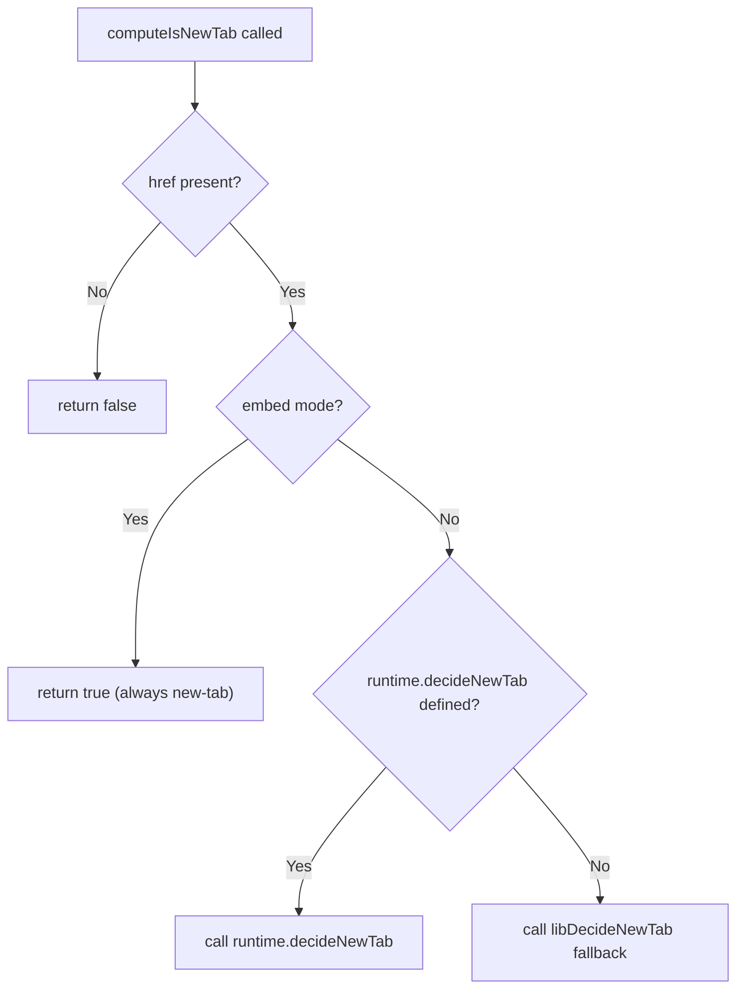

<!-- source-hash: 24346a4b70daaa3c49e151b19cf6cf28 -->
Provides pure helper functions for computing new-tab navigation decisions and building `<a>` anchor attribute objects used by chat-rendered links across inline cards, source chips, and runtime nav wrappers.

## Key Components

| Export | Signature | Purpose |
|--------|-----------|---------|
| `computeIsNewTab` | `(runtime, href, targetPlatform) → boolean` | Single source of truth for the new-tab rule; always returns `true` in `embed` mode, defers to `decideNewTab` callback or lib default in `host` mode |
| `newTabAnchorAttrs` | `(isNewTab) → { target?, rel? }` | Returns `_blank` + `noopener noreferrer` pair or empty object; safe to spread directly into JSX `<a>` |
| `buildAnchorProps` | `(href, isNewTab) → { href, target?, rel? } \| undefined` | Combines href + anchor attrs into a single `anchorProps` slot; returns `undefined` (not `{}`) when href is absent so card components can branch on `!= null` |

## Usage Example

```typescript
import {
  computeIsNewTab,
  buildAnchorProps,
} from './nav-anchor-props'

// Inside a card dispatcher wrapper
function CardLink({ runtime, chatRef, targetPlatform }) {
  const isNewTab = computeIsNewTab(runtime, chatRef.url, targetPlatform)
  const anchorProps = buildAnchorProps(chatRef.url, isNewTab)

  return anchorProps != null
    ? <a {...anchorProps}>{children}</a>
    : <span>{children}</span>
}
```

## Navigation Mode Rules



> **Important:** Do not inline the `embed` short-circuit or `decideNewTab` fallback chain elsewhere. `computeIsNewTab` is the **only** place this logic should live.